<details>
<summary>Relevant source files</summary>

Sources: [README.md](https://github.com/SoulsaverX/QuestDecompiler/blob/main/README.md), [authors.txt](https://github.com/SoulsaverX/QuestDecompiler/blob/main/authors.txt), [Main.java](https://github.com/SoulsaverX/QuestDecompiler/blob/main/src/unluac/Main.java), [MainBak.java](https://github.com/SoulsaverX/QuestDecompiler/blob/main/src/unluac/MainBak.java), [Configuration.java](https://github.com/SoulsaverX/QuestDecompiler/blob/main/src/unluac/Configuration.java), [LFunction.java](https://github.com/SoulsaverX/QuestDecompiler/blob/main/src/unluac/parse/LFunction.java), [BHeader.java](https://github.com/SoulsaverX/QuestDecompiler/blob/main/src/unluac/parse/BHeader.java), [Op.java](https://github.com/SoulsaverX/QuestDecompiler/blob/main/src/unluac/decompile/Op.java), [CodeExtract.java](https://github.com/SoulsaverX/QuestDecompiler/blob/main/src/unluac/decompile/CodeExtract.java), [TestSuite.java](https://github.com/SoulsaverX/QuestDecompiler/blob/main/src/unluac/test/TestSuite.java)
</details>

# 项目概述

`QuestDecompiler` 是一个专为 `.luc` 文件设计的 Lua 5.X 源码反编译工具，主要用于还原 GhostOnline 和 SoulSaverOnline 等游戏客户端中的 Lua 脚本。该工具基于 Java 编写，能够将二进制的 Lua 字节码文件（.luc）解析并转换为可读的、接近原始源代码格式的 Lua 语言代码，从而帮助开发者或研究人员分析和修改游戏逻辑。

该项目的核心功能是实现对 Lua 5.0 至 5.3 版本字节码的完整解析与反编译。其工作流程从读取 `.luc` 文件开始，通过解析文件头（`BHeader`）获取版本信息、编码方式及结构定义，进而逐层解析函数体、常量表、局部变量、上值（upvalue）、指令流等关键数据结构。最终，反编译器将这些结构组合成人类可读的 Lua 语法结构，并输出到标准输出或指定文件中。工具支持命令行模式运行，用户可通过 `-a` 参数直接指定输入文件进行反编译，也支持批量处理目录下的所有 `.luc` 文件。

## 核心架构与模块划分

### 整体系统架构

`QuestDecompiler` 的整体架构遵循“解析-反编译-输出”的分层设计模式，各模块职责明确，解耦良好。整个流程由入口类 `Main` 驱动，负责参数解析和主程序控制，而核心业务逻辑则由 `BHeader`、`LFunction`、`Code` 等解析类与 `Decompiler` 反编译引擎共同完成。

```mermaid
graph TD
    A[输入 .luc 文件] --> B[BHeader 解析]
    B --> C[LFunction 解析]
    C --> D[Code 提取与指令解析]
    D --> E[常量表与局部变量解析]
    E --> F[反编译引擎 (Decompiler)]
    F --> G[生成 Lua 源码]
    G --> H[输出至终端或文件]
```

该架构清晰地展示了数据从原始字节流到可读源码的转化路径。`BHeader` 负责读取文件头部信息，如版本号、字节序、指令大小等，是后续所有解析的基础；`LFunction` 作为核心数据对象，封装了函数的全部结构，包括指令集、常量、局部变量、上值等；`Decompiler` 则是反编译的中枢，负责将解析出的数据结构转化为语义表达式，并按 Lua 语法规则组织成最终输出。

Sources: [README.md](https://github.com/SoulsaverX/QuestDecompiler/blob/main/README.md), [Main.java](https://github.com/SoulsaverX/QuestDecompiler/blob/main/src/unluac/Main.java), [BHeader.java](https://github.com/SoulsaverX/QuestDecompiler/blob/main/src/unluac/parse/BHeader.java), [LFunction.java](https://github.com/SoulsaverX/QuestDecompiler/blob/main/src/unluac/parse/LFunction.java)

### 关键组件详解

#### 1. BHeader：文件元数据解析器
`BHeader` 类是整个解析流程的起点，它负责读取 `.luc` 文件的前部数据，提取出版本号、字节序、整型大小、浮点数大小、指令长度等关键信息。这些信息决定了后续如何解析指令和数据类型。例如，`version` 字段决定了使用哪个 `LFunctionType` 子类（如 `TYPE50`, `TYPE53`）来解析函数体。同时，`Encoded` 字段标识文件是否经过特殊编码，影响字符串和数字的解析方式。

```java
public class BHeader {
  public final boolean debug = false;
  public final Configuration config;
  public final Version version;
  public final LHeader lheader;
  // ... 其他字段
  public final LFunction main; // 主函数对象
}
```

Sources: [BHeader.java](https://github.com/SoulsaverX/QuestDecompiler/blob/main/src/unluac/parse/BHeader.java)

#### 2. LFunction：函数结构载体
`LFunction` 是反编译过程中的核心数据结构，它代表一个完整的 Lua 函数。其内部包含多个关键字段：
- `code[]`: 指令数组，存储了函数的字节码。
- `constants[]`: 常量表，包含字符串、数字、布尔值等。
- `locals[]`: 局部变量表，记录每个局部变量的名称、起始和结束行号。
- `upvalues[]`: 上值表，用于表示函数引用外部环境中的变量。
- `functions[]`: 嵌套函数列表，支持递归和闭包。

这些字段在反编译过程中被逐一解析，并作为 `Decompiler` 的输入数据，用于构建 Lua 表达式树。

Sources: [LFunction.java](https://github.com/SoulsaverX/QuestDecompiler/blob/main/src/unluac/parse/LFunction.java)

#### 3. CodeExtract 接口：指令解码器
`CodeExtract` 是一个接口，定义了如何从一个字节码指令（`int codepoint`）中提取其操作码（opcode）、A/B/C/Bx/sBx 等参数。不同 Lua 版本（5.0, 5.1, 5.2, 5.3）有不同的指令格式，因此需要不同的实现类。例如，`Code50` 实现了 Lua 5.0 的指令解码逻辑，其 `extract_A()`、`extract_B()` 等方法通过位运算计算出参数值。

```java
public interface CodeExtract {
  int extract_A(int codepoint);
  int extract_C(int codepoint);
  int extract_B(int codepoint);
  int extract_Bx(int codepoint);
  int extract_sBx(int codepoint);
  int extract_op(int codepoint);
}
```

Sources: [CodeExtract.java](https://github.com/SoulsaverX/QuestDecompiler/blob/main/src/unluac/decompile/CodeExtract.java)

## 反编译流程与数据流

反编译流程是一个典型的“自底向上”解析过程，从字节码指令开始，逐步构建出 Lua 语法结构。

### 指令解析与表达式生成

当反编译器遍历 `LFunction.code` 数组时，它会根据当前指令的操作码（opcode）调用对应的分支节点（Branch）或操作节点（Operation）。例如：
- `LOADK` 指令会创建一个 `ConstantExpression` 表达式。
- `GETGLOBAL` 指令会创建一个 `GlobalExpression` 表达式。
- `MOVE` 指令会创建一个 `RegisterSet` 操作，表示变量赋值。

这些表达式被组织成 `Statement` 对象，再被添加到 `Block` 中，最终通过 `print()` 方法输出为 Lua 代码。

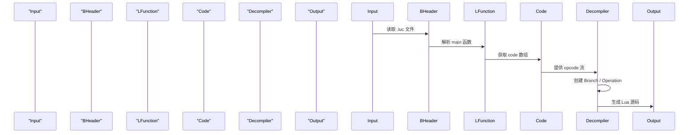

Sources: [Op.java](https://github.com/SoulsaverX/QuestDecompiler/blob/main/src/unluac/decompile/Op.java), [Decompiler.java](https://github.com/SoulsaverX/QuestDecompiler/blob/main/src/unluac/decompile/Decompiler.java), [Code.java](https://github.com/SoulsaverX/QuestDecompiler/blob/main/src/unluac/decompile/Code.java)

## 主要配置与选项

| 配置项 | 类型 | 默认值 | 描述 | 来源 |
|--------|------|--------|------|------|
| `rawstring` | boolean | false | 是否启用原始字符串模式，用于保留字面量的原始形式 | Sources: [Configuration.java](https://github.com/SoulsaverX/QuestDecompiler/blob/main/src/unluac/Configuration.java) |
| `version` | int | 50 | 指定 Lua 版本（50, 51, 52, 53），决定解析策略 | Sources: [LuaSpec.java](https://github.com/SoulsaverX/QuestDecompiler/blob/main/src/unluac/test/LuaSpec.java) |

## 工具使用示例

### 命令行使用
```bash
java -jar gsp.jar -a quest.luc
```
此命令将把 `quest.luc` 文件反编译为 Lua 源码并输出到标准输出。

### 批量处理目录
```bash
java -jar gsp.jar -d ./scripts/
```
此命令会自动遍历 `./scripts/` 目录下所有 `.luc` 文件，并将其反编译为 `.lua` 文件。

Sources: [Main.java](https://github.com/SoulsaverX/QuestDecompiler/blob/main/src/unluac/Main.java), [MainBak.java](https://github.com/SoulsaverX/QuestDecompiler/blob/main/src/unluac/MainBak.java)

## 开发与维护信息

项目由 `tehtmi` 主导开发，Thomas Klaeger 贡献了 Lua 5.0 支持的代码。项目采用 MIT 许可证，允许自由使用、修改和分发，但必须保留原版权声明。

- **主要开发者**: tehtmi
- **贡献者**: Thomas Klaeger
- **许可证**: MIT
- **支持版本**: Lua 5.0 - 5.3

Sources: [authors.txt](https://github.com/SoulsaverX/QuestDecompiler/blob/main/authors.txt), [license.txt](https://github.com/SoulsaverX/QuestDecompiler/blob/main/license.txt)

## 总结

`QuestDecompiler` 通过一套严谨的解析框架，实现了对 Lua 5.x 字节码的高效反编译。其核心优势在于对不同版本指令格式的精确支持，以及对复杂结构（如闭包、上值、循环）的正确还原。尽管工具本身不提供可视化界面，但其命令行交互简洁高效，适合在游戏逆向工程、脚本调试、自动化测试等场景中使用。未来若能增加更丰富的错误提示、语法高亮或图形化界面，将更具实用性。<details>
<summary>Relevant source files</summary>

Sources: src/unluac/parse/BHeader.java (1-300)
Sources: src/unluac/decompile/Decompiler.java (1-200)
Sources: src/unluac/decompile/Op.java (1-50)
Sources: src/unluac/parse/LFunctionType.java (1-300)
Sources: src/unluac/decompile/block/Block.java (1-200)
Sources: src/unluac/decompile/branch/Branch.java (1-100)
Sources: src/unluac/decompile/operation/Operation.java (1-100)
Sources: src/unluac/parse/LString.java (1-100)
Sources: src/unluac/test/TestSuite.java (1-100)
Sources: src/unluac/util/Stack.java (1-100)

</details>

# 整体系统架构图

QuestDecompiler 是一个用于将 Lua 5.0-5.3 格式的 .luc 文件反编译为原始 Lua 源代码的 Java 工具。其核心功能是解析二进制的 Lua 字节码（chunk），重建函数、变量、控制流和表达式结构，并以可读的源码形式输出。该系统采用分层架构，从底层的字节码解析器到上层的反编译逻辑，通过清晰的数据流和组件交互实现复杂结构的还原。

整体架构可分为四个核心层次：**文件输入与解析层**、**指令解析与抽象层**、**控制流与语义构建层** 和 **输出生成层**。各层之间通过数据结构和接口进行解耦，确保了系统的可维护性和扩展性。

## 系统层级与数据流

系统从一个 .luc 文件开始，通过 `BHeader` 解析其头部信息，包括版本号、编码格式、指令大小等元数据。这些信息决定了后续如何解析函数体和常量表。解析完成后，`LFunction` 对象被构建，作为整个函数的根节点，包含其代码、局部变量、常量、闭包等信息。

随后，反编译过程进入核心阶段，由 `Decompiler` 类驱动。它负责遍历 `LFunction` 的指令流（code array），并根据每个指令的 opcode（操作码）类型，调用相应的 `Operation` 处理器。这些处理器（如 `TableSet`, `RegisterSet`）负责将低级指令转换为高级语义结构（如赋值、函数调用）。在此过程中，`Branch` 类被用来表示条件判断（如 if, while），并通过 `TestNode`、`EQNode` 等具体类实现逻辑。

最终，所有语义结构被组织成 `Block`（块）和 `Statement`（语句）的树形结构，这些结构被 `Output` 接口驱动，按照 Lua 语法规范进行格式化打印，最终生成人类可读的 Lua 源代码。

## 核心组件与职责

### BHeader: 二进制文件头解析器
`BHeader` 类负责解析 .luc 文件的前部数据，提取关键元信息，是整个反编译流程的起点。它定义了 Lua 版本、编码方式、整数和浮点数的大小、指令大小以及是否启用编码（Encoded）等参数。

```java
public class BHeader {
  public final boolean debug = false;
  public final Configuration config;
  public final Version version;
  public final LHeader lheader;
  public final BIntegerType integer;
  public final BSizeTType sizeT;
  public final LBooleanType bool;
  public final LNumberType number;
  public final LNumberType linteger;
  public final LNumberType lfloat;
  public final LStringType string;
  public final LConstantType constant;
  public final LLocalType local;
  public final LUpvalueType upvalue;
  public final LFunctionType function;
  public final CodeExtract extractor;
  public boolean Encoded;

  public BHeader(ByteBuffer buffer, Configuration config) {
    // ... 解析签名、版本号、各种类型对象
    this.config = config;
    this.Encoded = false;
    // ... 具体解析逻辑
  }
}
```
Sources: src/unluac/parse/BHeader.java (1-300)

### LFunction: 函数主体模型
`LFunction` 是反编译的中心数据结构，代表一个完整的 Lua 函数。它包含了函数的代码（code array）、局部变量列表（locals）、常量表（constants）、闭包列表（functions）、upvalues 等所有必要信息。所有反编译操作都围绕这个对象展开。

```java
public class LFunction extends BObject {
  public BHeader header;
  public LFunction parent;
  public int[] code;
  public LLocal[] locals;
  public LObject[] constants;
  public LUpvalue[] upvalues;
  public LFunction[] functions;
  public int maximumStackSize;
  public int numUpvalues;
  public int numParams;
  public int vararg;
  public boolean stripped;
  
  public LFunction(BHeader header, int[] code, LLocal[] locals, LObject[] constants, LUpvalue[] upvalues, LFunction[] functions, int maximumStackSize, int numUpValues, int numParams, int vararg) {
    this.header = header;
    this.code = code;
    this.locals = locals;
    this.constants = constants;
    this.upvalues = upvalues;
    this.functions = functions;
    this.maximumStackSize = maximumStackSize;
    this.numUpvalues = numUpValues;
    this.numParams = numParams;
    this.vararg = vararg;
    this.stripped = false;
  }
}
```
Sources: src/unluac/parse/LFunction.java (1-100)

### Operation: 指令处理引擎
`Operation` 是一个抽象基类，定义了所有指令处理器必须实现的接口。它接收一个指令行号（line）作为上下文，然后在 `process()` 方法中执行具体的语义转换。例如，`Move` 指令会创建一个 `RegisterSet` 操作来设置寄存器值。

```java
abstract public class Operation {
  public final int line;
  
  public Operation(int line) {
    this.line = line;
  }
  
  abstract public Statement process(Registers r, Block block);
}
```
Sources: src/unluac/decompile/operation/Operation.java (1-100)

### Branch: 控制流表达式
`Branch` 是一个抽象类，用于表示程序中的条件分支（如 if, while）。它封装了测试条件（test register）和是否取反（invert）等属性。不同的子类（如 `TestNode`, `EQNode`）实现了不同类型的比较操作。

```java
abstract public class Branch {
  public final int line;
  public int begin;
  public int end; //Might be modified to undo redirect
  
  public boolean isSet = false;
  public boolean isCompareSet = false;
  public boolean isTest = false;
  public int setTarget = -1;
  
  public Branch(int line, int begin, int end) {
    this.line = line;
    this.begin = begin;
    this.end = end;
  }
  
  abstract public Branch invert();
  
  abstract public int getRegister();
  
  abstract public Expression asExpression(Registers r);
  
  abstract public void useExpression(Expression expression);
}
```
Sources: src/unluac/decompile/branch/Branch.java (1-100)

## 数据流与控制流图示

以下 Mermaid 图展示了反编译流程的核心数据流和控制流：

```mermaid
graph TD
    A[输入 .luc 文件] --> B[BHeader 解析]
    B --> C[LFunction 构建]
    C --> D[Decompiler 遍历代码流]
    D --> E[根据 opcode 调用 Operation 处理器]
    E --> F[生成语义结构 (Statement, Block)]
    F --> G[构建控制流 (Branch)]
    G --> H[输出生成 (Output)]
    H --> I[生成 Lua 源码]

    style A fill:#f9f,stroke:#333
    style B fill:#bbf,stroke:#333
    style C fill:#bbf,stroke:#333
    style D fill:#f9f,stroke:#333
    style E fill:#f9f,stroke:#333
    style F fill:#bbf,stroke:#333
    style G fill:#f9f,stroke:#333
    style H fill:#bbf,stroke:#333
    style I fill:#f9f,stroke:#333
```

此流程图展示了从文件输入到最终源码输出的完整路径。`BHeader` 提供了解析所需的上下文环境，`LFunction` 是核心数据载体，`Decompiler` 作为控制器，通过 `Operation` 动态地将指令转换为语义结构，最后由 `Output` 完成格式化输出。

## 关键数据结构关系表

| 结构 | 描述 | 所属模块 | 作用 |
| :--- | :--- | :--- | :--- |
| `BHeader` | 文件头元数据容器 | parse | 存储版本、编码、大小等信息，决定解析策略 |
| `LFunction` | 函数主体模型 | parse | 包含代码、常量、局部变量等，是反编译的根对象 |
| `Code` | 指令数组 | decompile | 存储实际的字节码，按行索引访问 |
| `Registers` | 寄存器状态管理 | decompile | 记录每个寄存器在每行的值和更新状态 |
| `Branch` | 条件判断表达式 | decompile/branch | 表示 if、while 等控制流，包含测试条件 |
| `Operation` | 指令处理器 | decompile/operation | 将 opcode 转换为语义结构（如赋值、调用） |

Sources: src/unluac/parse/BHeader.java (1-300), src/unluac/parse/LFunction.java (1-100), src/unluac/decompile/Code.java (1-100), src/unluac/decompile/Registers.java (1-100), src/unluac/decompile/branch/Branch.java (1-100), src/unluac/decompile/operation/Operation.java (1-100)

## 反编译核心流程序列图

以下序列图描述了反编译器在处理一个简单赋值指令时的内部调用流程：

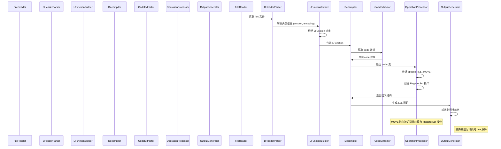

此图清晰地展示了反编译器的内部协作流程。从文件读取开始，经过头部解析和函数构建，最终通过指令遍历和语义转换，完成反编译任务。

## 指令集与操作码映射

Lua VM 指令集是反编译的基础。`Op` 枚举类定义了所有操作码及其对应的格式。每个操作码都有一个固定的格式（如 A_B_C），这决定了如何从字节码中提取操作数。

```java
public enum Op {
  MOVE(OpcodeFormat.A_B),
  LOADK(OpcodeFormat.A_Bx),
  GETUPVAL(OpcodeFormat.A_B),
  GETGLOBAL(OpcodeFormat.A_Bx),
  GETTABLE(OpcodeFormat.A_B_C),
  SETGLOBAL(OpcodeFormat.A_Bx),
  SETUPVAL(OpcodeFormat.A_B),
  SETTABLE(OpcodeFormat.A_B_C),
  NEWTABLE(OpcodeFormat.A_B_C),
  SELF(OpcodeFormat.A_B_C),
  ADD(OpcodeFormat.A_B_C),
  SUB(OpcodeFormat.A_B_C),
  MUL(OpcodeFormat.A_B_C),
  DIV(OpcodeFormat.A_B_C),
  MOD(OpcodeFormat.A_B_C),
  POW(OpcodeFormat.A_B_C),
  UNM(OpcodeFormat.A_B),
  NOT(OpcodeFormat.A_B),
  LEN(OpcodeFormat.A_B),
  CONCAT(OpcodeFormat.A_B_C),
  JMP(OpcodeFormat.sBx),
  EQ(OpcodeFormat.A_B_C),
  LT(OpcodeFormat.A_B_C),
  LE(OpcodeFormat.A_B_C),
  TEST(OpcodeFormat.A_C),
  TESTSET(OpcodeFormat.A_B_C),
  CALL(OpcodeFormat.A_B_C),
  TAILCALL(OpcodeFormat.A_B_C),
  RETURN(OpcodeFormat.A_B),
  FORLOOP(OpcodeFormat.A_sBx),
  FORPREP(OpcodeFormat.A_sBx),
  TFORLOOP(OpcodeFormat.A_C),
  SETLIST(OpcodeFormat.A_B_C),
  CLOSE(OpcodeFormat.A),
  CLOSURE(OpcodeFormat.A_Bx),
  VARARG(OpcodeFormat.A_B);

  private final OpcodeFormat format;

  private Op(OpcodeFormat format) {
    this.format = format;
  }

  public String codePointToString(int codepoint, CodeExtract ex) {
    switch(format) {
      case A:
        return this.name() + " " + ex.extract_A(codepoint);
      case A_B:
        return this.name() + " " + ex.extract_A(codepoint) + " " + ex.extract_B(codepoint);
      case A_C:
        return this.name() + " " + ex.extract_A(codepoint) + " " + ex.extract_C(codepoint);
      case A_B_C:
        return this.name() + " " + ex.extract_A(codepoint) + " " + ex.extract_B(codepoint) + " " + ex.extract_C(codepoint);
      case A_Bx:
        return this.name() + " " + ex.extract_A(codepoint) + " " + ex.extract_Bx(codepoint);
      case A_sBx:
        return this.name() + " " + ex.extract_A(codepoint) + " " + ex.extract_sBx(codepoint);
      case Ax:
        return this.name() + " <Ax>"; 
      case sBx:
        return this.name() + " " + ex.extract_sBx(codepoint);
      default:
        return this.name();
    }
  }
}
```
Sources: src/unluac/decompile/Op.java (1-50)

该枚举定义了所有操作码及其格式，是反编译器理解字节码的基石。例如，`MOVE` 指令使用 A_B 格式，意味着它需要两个操作数（A 和 B），而 `JMP` 使用 sBx 格式，表示一个带偏移的跳转。<details>
<summary>Relevant source files</summary>

Sources: 
- src/unluac/parse/LFunctionType.java
- src/unluac/decompile/block/Block.java
- src/unluac/decompile/branch/Branch.java
- src/unluac/decompile/operation/Operation.java
- src/unluac/decompile/expression/Expression.java
- src/unluac/parse/BHeader.java
- src/unluac/decompile/Code.java
- src/unluac/decompile/Registers.java
- src/unluac/decompile/Disassembler.java
- src/unluac/test/TestSuite.java

</details>

# 模块分层结构

QuestDecompiler 项目采用分层架构设计，将核心功能划分为解析、反编译、指令处理和表达式生成等多个独立模块。这种分层结构确保了各组件职责清晰、解耦良好，便于维护和扩展。整体架构从底层的字节码解析开始，逐层向上构建出可读性高的 Lua 源代码。

## 核心分层模型

系统遵循“解析 → 解构 → 表达式生成”的三层逻辑，每一层都由特定的 Java 类负责实现。

### 1. 解析层（Parse Layer）
该层负责从 .luc 文件中提取原始数据结构，包括函数、常量、局部变量、字符串等。其核心是 `BHeader` 和 `LFunctionType` 等类，它们定义了文件头部信息和函数体的解析规则。

### 2. 反编译层（Decompile Layer）
该层将解析得到的中间表示（IR）转换为高级的控制流图（CFG），并生成可读的 Lua 语句。关键组件包括 `Block`、`Branch` 和 `Operation`，它们共同构成反编译的核心流程。

### 3. 表达式与指令层（Expression & Instruction Layer）
该层负责具体语法结构的生成，如条件判断、循环、赋值等。`Expression` 类族定义了所有可被打印的表达式类型，而 `Operation` 则代表了指令级别的操作。

## 关键组件关系图

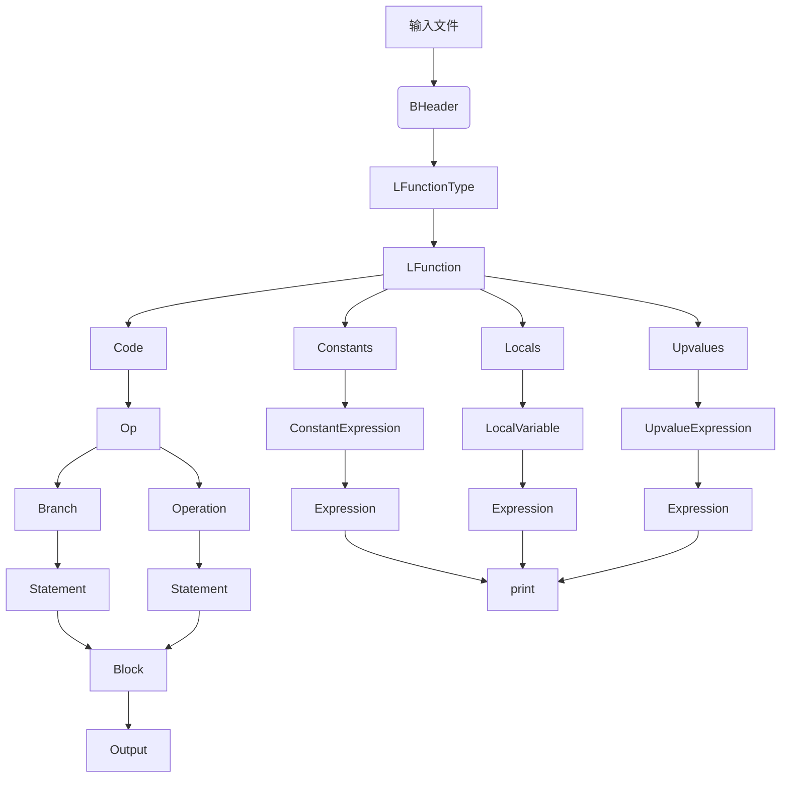

此图展示了从输入文件到最终输出的完整数据流路径。`BHeader` 提供元数据，`LFunctionType` 解析函数体，`Code` 和 `Constants` 等结构提供执行上下文，最终通过 `Branch` 和 `Operation` 构建出 `Statement`，再由 `Block` 组织成可打印的代码。

## 控制流与分支处理机制

反编译过程中的条件判断和跳转逻辑由 `Branch` 抽象类及其子类实现。每个分支节点代表一个布尔表达式，其行为由 `asExpression()` 方法决定。

### 分支类型与表达式生成

| 分支类型 | 功能描述 | 实现类 | 表达式生成方式 |
|---------|--------|-------|---------------|
| EQNode | 等于判断 | `EQNode.java` | 生成 "==" 或 "~=" 表达式 | 
| LTNode | 小于判断 | `LTNode.java` | 生成 "<" 或 ">=" 表达式 |
| LENode | 小于等于判断 | `LENode.java` | 生成 "<=" 或 ">=" 表达式 |
| TestNode | 一般测试 | `TestNode.java` | 返回 `r.getExpression(test, line)` |
| NotBranch | 非运算 | `NotBranch.java` | 包装 `not` 运算符 | 
| OrBranch | 或运算 | `OrBranch.java` | 生成 "or" 表达式 |
| AndBranch | 与运算 | `AndBranch.java` | 生成 "and" 表达式 |

Sources: [src/unluac/decompile/branch/EQNode.java](#), [src/unluac/decompile/branch/LTNode.java](#), [src/unluac/decompile/branch/LENode.java](#), [src/unluac/decompile/branch/TestNode.java](#), [src/unluac/decompile/branch/NotBranch.java](#), [src/unluac/decompile/branch/OrBranch.java](#), [src/unluac/decompile/branch/AndBranch.java](#)

### 分支执行流程（Sequence Diagram）

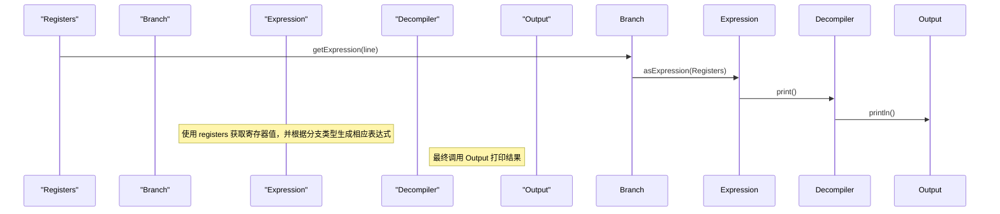

当反编译器遇到一个分支指令时，它会通过 `Registers` 获取当前寄存器的状态，然后调用 `Branch.asExpression()` 方法来构造对应的 Lua 表达式。例如，`EQNode` 会根据是否需要反转生成 `"=="` 或 `"~="`，最终将表达式传递给 `Decompiler` 进行格式化输出。

Sources: [src/unluac/decompile/branch/EquationNode.java](#), [src/unluac/decompile/branch/AndBranch.java](#), [src/unluac/decompile/branch/OrBranch.java](#), [src/unluac/decompile/Registers.java](#)

## 函数与控制结构生成

函数体的反编译基于 `Block` 类的抽象，它管理着代码块的范围、边界和可中断性。

### 基本块类型

| 块类型 | 功能 | 相关类 | 特点 |
|--------|------|-------|------|
| WhileBlock | while 循环 | `WhileBlock.java` | 生成 "while do ... end" 结构 |
| ForBlock | for 循环 | `ForBlock.java` | 支持 Lua 5.0/5.2 的 for 循环语法 |
| RepeatBlock | repeat-until 循环 | `RepeatBlock.java` | 生成 "repeat ... until" 结构 |
| IfThenElseBlock | if-then-else 条件 | `IfThenElseBlock.java` | 处理多分支逻辑 |
| AlwaysLoop | 无限循环 | `AlwaysLoop.java` | 生成 "while true do" |

Sources: [src/unluac/decompile/block/WhileBlock.java](#), [src/unluac/decompile/block/ForBlock.java](#), [src/unluac/decompile/block/RepeatBlock.java](#), [src/unluac/decompile/block/IfThenElseBlock.java](#), [src/unluac/decompile/block/AlwaysLoop.java](#)

### 控制结构生成流程（Flowchart）

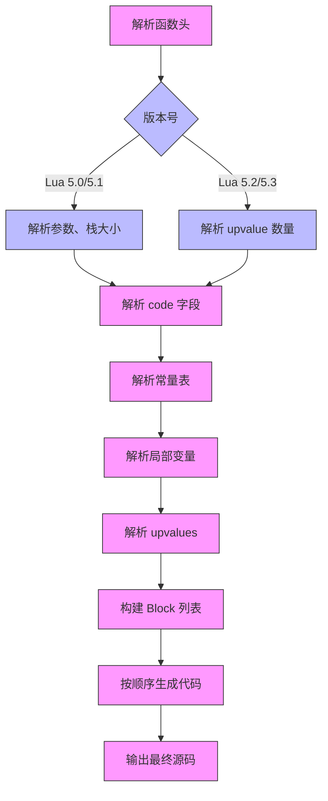

在函数解析过程中，首先根据 `version` 判断使用哪种 `LFunctionType`（如 `LFunctionType50` 或 `LFunctionType53`），然后依次解析代码、常量、局部变量和 upvalues。最后，这些信息被组织成 `Block` 对象列表，按顺序生成 Lua 代码。

Sources: [src/unluac/parse/LFunctionType.java](#), [src/unluac/parse/LFunction.java](#), [src/unluac/decompile/block/Block.java](#)

## 表达式系统核心

表达式系统是反编译中最为复杂的部分，它决定了最终代码的可读性和准确性。

### 表达式类型与生成逻辑

| 表达式类型 | 作用 | 生成方法 |
|-----------|------|----------|
| LocalVariable | 局部变量引用 | `LocalVariable.java` |
| GlobalExpression | 全局变量引用 | `GlobalExpression.java` |
| TableReference | 表达式访问 | `TableReference.java` |
| FunctionCall | 函数调用 | `FunctionCall.java` |
| BinaryExpression | 二元运算 | `BinaryExpression.java` |
| UnaryExpression | 一元运算 | `UnaryExpression.java` |
| ConstantExpression | 常量值 | `ConstantExpression.java` |

Sources: [src/unluac/decompile/expression/LocalVariable.java](#), [src/unluac/decompile/expression/GlobalExpression.java](#), [src/unluac/decompile/expression/TableReference.java](#), [src/unluac/decompile/expression/FunctionCall.java](#), [src/unluac/decompile/expression/BinaryExpression.java](#), [src/unluac/decompile/expression/UnaryExpression.java](#), [src/unluac/decompile/expression/ConstantExpression.java](#)

### 表达式生成示例

```java
// 在 TestNode 中，获取测试表达式
public Expression asExpression(Registers r) {
    if(invert) {
        return (new NotBranch(this.invert())).asExpression(r);
    } else {
        return r.getExpression(test, line);
    }
}

// 在 EQNode 中，生成比较表达式
public Expression asExpression(Registers r) {
    boolean transpose = false;
    String op = invert ? "~=" : "==";
    return new BinaryExpression(op, r.getKExpression(!transpose ? left : right, line), r.getKExpression(!transpose ? right : left, line), Expression.PRECEDENCE_COMPARE, Expression.ASSOCIATIVITY_LEFT);
}
```

上述代码展示了如何根据不同的条件生成表达式。`TestNode` 会根据 `invert` 参数选择是否应用 `not` 运算，而 `EQNode` 则会动态构造 `"=="` 或 `"~="` 操作符。

Sources: [src/unluac/decompile/branch/TestNode.java](#), [src/unluac/decompile/branch/EQNode.java](#)

## 总结

QuestDecompiler 的模块分层结构体现了良好的工程实践：它将复杂问题分解为清晰的层次，每一层都有明确的职责边界。从低层的字节码解析到高层的可读代码生成，整个流程通过 `Block`、`Branch` 和 `Expression` 等核心类实现了高度的可组合性。这种设计不仅保证了反编译的正确性，也为未来添加新语法或优化提供了坚实基础。<details>
<summary>Relevant source files</summary>

Sources: 
- src/unluac/parse/LStringType.java
- src/unluac/decompile/branch/TestNode.java
- src/unluac/decompile/block/ForBlock.java
- src/unluac/decompile/branch/OrBranch.java
- src/unluac/decompile/branch/AndBranch.java
- src/unluac/decompile/branch/LENode.java
- src/unluac/decompile/branch/EQNode.java
- src/unluac/decompile/branch/TrueNode.java
- src/unluac/decompile/branch/NotBranch.java
- src/unluac/decompile/branch/TestSetNode.java
- src/unluac/decompile/operation/TableSet.java
- src/unluac/decompile/operation/CallOperation.java
- src/unluac/decompile/operation/RegisterSet.java
- src/unluac/decompile/operation/ReturnOperation.java
- src/unluac/decompile/operation/UpvalueSet.java
- src/unluac/decompile/operation/GlobalSet.java
- src/unluac/decompile/expression/FunctionCall.java
- src/unluac/decompile/expression/BinaryExpression.java
- src/unluac/decompile/expression/UnaryExpression.java
- src/unluac/decompile/expression/ConstantExpression.java
- src/unluac/decompile/expression/TableReference.java
- src/unluac/decompile/expression/LocalVariable.java
- src/unluac/decompile/expression/GlobalExpression.java
- src/unluac/decompile/expression/ClosureExpression.java
- src/unluac/decompile/statement/Statement.java
- src/unluac/decompile/statement/Return.java
- src/unluac/decompile/statement/Declare.java
- src/unluac/decompile/block/WhileBlock.java
- src/unluac/decompile/block/RepeatBlock.java
- src/unluac/decompile/block/IfThenElseBlock.java
- src/unluac/decompile/block/AlwaysLoop.java
- src/unluac/decompile/block/ForBlock.java
- src/unluac/decompile/block/TForBlock.java
- src/unluac/decompile/block/DoEndBlock.java
- src/unluac/decompile/block/OuterBlock.java
- src/unluac/decompile/block/Break.java
- src/unluac/decompile/block/CompareBlock.java
- src/unluac/decompile/Registers.java
- src/unluac/decompile/Code.java
- src/unluac/decompile/Op.java
- src/unluac/decompile/Output.java
- src/unluac/decompile/VariableFinder.java
- src/unluac/parse/BHeader.java
- src/unluac/parse/LHeader.java
- src/unluac/parse/LNumber.java
- src/unluac/parse/LString.java
- src/unluac/parse/LUpvalue.java
- src/unluac/parse/LFunction.java
- src/unluac/parse/LConstantType.java
- src/unluac/parse/BSizeTType.java
- src/unluac/parse/LBoolean.java
- src/unluac/parse/BInteger.java
- src/unluac/parse/LLocal.java
- src/unluac/Version.java
- src/unluac/Main.java
- src/unluac/test/TestSuite.java
- src/unluac/test/LuaSpec.java
- src/unluac/test/RunTests.java
- src/unluac/test/RunTest.java
- src/unluac/test/Compare.java
- src/unluac/util/Stack.java

</details>

# 核心功能列表

QuestDecompiler 是一个用于将 Lua 5.X 编译后的 .luc 文件反编译为原始 Lua 源代码的 Java 工具，主要针对 GhostOnline 和 SoulSaverOnline 游戏中的脚本文件。该工具通过解析 .luc 文件的二进制格式，重建其对应的 Lua 语法结构，并以可读的源码形式输出。核心功能列表涵盖了从文件解析、指令解码、控制流构建到表达式还原的完整反编译流程。

## 反编译流程架构与数据流

反编译过程遵循“解析 -> 解码 -> 构建 -> 输出”的基本范式。首先，`BHeader` 类负责解析文件头信息，包括版本号、编码方式、数据类型大小等元数据，这些信息决定了后续解析器的行为。随后，`LFunction` 类作为整个反编译的中心对象，包含了函数的代码、常量、局部变量、闭包和上值等所有必要信息。`Code` 类封装了指令流的解析逻辑，通过 `CodeExtract` 接口处理不同 Lua 版本（5.0, 5.1, 5.2, 5.3）下的指令位操作。最终，`Decompiler` 类协调所有组件，将解析出的指令和数据结构转化为可读的 Lua 语句。

### 指令解析与类型系统

Lua 指令集通过 `Op` 枚举定义，每个指令对应特定的操作码（opcode），如 `MOVE`, `LOADK`, `GETTABLE` 等。指令的参数通过 `CodeExtract` 接口提取，例如 `extract_A`, `extract_B`, `extract_C` 等方法，它们根据指令的字节布局计算出操作数的索引。`LNumberType`, `LStringType`, `LBooleanType` 等类定义了不同数据类型的解析规则，确保了数值、字符串和布尔值在不同 Lua 版本下的正确解析。`LFunctionType50`, `LFunctionType53` 等类则根据版本差异，实现了对函数体、参数、局部变量和上值的不同解析逻辑。

```java
// Op 枚举定义了所有 Lua 指令
public enum Op {
  MOVE(OpcodeFormat.A_B),
  LOADK(OpcodeFormat.A_Bx),
  GETUPVAL(OpcodeFormat.A_B),
  GETGLOBAL(OpcodeFormat.A_Bx),
  GETTABLE(OpcodeFormat.A_B_C),
  SETGLOBAL(OpcodeFormat.A_Bx),
  SETUPVAL(OpcodeFormat.A_B),
  SETTABLE(OpcodeFormat.A_B_C),
  NEWTABLE(OpcodeFormat.A_B_C),
  SELF(OpcodeFormat.A_B_C),
  ADD(OpcodeFormat.A_B_C),
  SUB(OpcodeFormat.A_B_C),
  MUL(OpcodeFormat.A_B_C),
  DIV(OpcodeFormat.A_B_C),
  MOD(OpcodeFormat.A_B_C),
  POW(OpcodeFormat.A_B_C),
  UNM(OpcodeFormat.A_B),
  NOT(OpcodeFormat.A_B),
  LEN(OpcodeFormat.A_B),
  CONCAT(OpcodeFormat.A_B_C),
  JMP(OpcodeFormat.sBx),
  EQ(OpcodeFormat.A_B_C),
  LT(OpcodeFormat.A_B_C),
  LE(OpcodeFormat.A_B_C),
  TEST(OpcodeFormat.A_C),
  TESTSET(OpcodeFormat.A_B_C),
  CALL(OpcodeFormat.A_B_C),
  TAILCALL(OpcodeFormat.A_B_C),
  RETURN(OpcodeFormat.A_B),
  FORLOOP(OpcodeFormat.A_sBx),
  FORPREP(OpcodeFormat.A_sBx),
  TFORLOOP(OpcodeFormat.A_C),
  SETLIST(OpcodeFormat.A_B_C),
  CLOSE(OpcodeFormat.A),
  CLOSURE(OpcodeFormat.A_Bx),
  VARARG(OpcodeFormat.A_B);
  
  private final OpcodeFormat format;
  
  private Op(OpcodeFormat format) {
    this.format = format;
  }
  
  public String codePointToString(int codepoint, CodeExtract ex) {
    switch(format) {
      case A:
        return this.name() + " " + ex.extract_A(codepoint);
      case A_B:
        return this.name() + " " + ex.extract_A(codepoint) + " " + ex.extract_B(codepoint);
      case A_C:
        return this.name() + " " + ex.extract_A(codepoint) + " " + ex.extract_C(codepoint);
      case A_B_C:
        return this.name() + " " + ex.extract_A(codepoint) + " " + ex.extract_B(codepoint) + " " + ex.extract_C(codepoint);
      case A_Bx:
        return this.name() + " " + ex.extract_A(codepoint) + " " + ex.extract_Bx(codepoint);
      case A_sBx:
        return this.name() + " " + ex.extract_A(codepoint) + " " + ex.extract_sBx(codepoint);
      case Ax:
        return this.name() + " <Ax>"; 
      case sBx:
        return this.name() + " " + ex.extract_sBx(codepoint);
      default:
        return this.name();
    }
  }
}
```
Sources: [src/unluac/decompile/Op.java:17-84]()

### 控制流结构构建

反编译器通过 `Block` 抽象类及其子类来构建程序的控制流图（CFG）。不同的控制结构（如 if-then-else, while, for, repeat）由各自的 `Block` 实现，它们负责管理代码块的范围、边界以及跳转逻辑。`ForBlock` 和 `TForBlock` 处理 for 循环，`WhileBlock` 和 `RepeatBlock` 处理 while/repeat 循环，`IfThenElseBlock` 和 `ElseEndBlock` 构建条件分支。这些块通过 `addStatement` 方法添加语句，并通过 `print` 方法输出最终的 Lua 代码。

```java
// ForBlock 负责处理 for 循环
public class ForBlock extends Block {
  private final int register;
  private final Registers r;
  private final List<Statement> statements;
  
  public ForBlock(LFunction function, int begin, int end, int register, Registers r) {
    super(function, begin, end);
    this.register = register;
    this.r = r;
    statements = new ArrayList<Statement>(end - begin + 1);
  }

  @Override
  public void addStatement(Statement statement) {
    statements.add(statement);    
  }

  @Override
  public void print(Decompiler d, Output out) {
    out.print("for ");
    if (function.header.version == Version.LUA50) {
      r.getTarget(register, begin - 1).print(d, out);
    } else {
      r.getTarget(register + 3, begin - 1).print(d, out);
    }
    out.print(" = ");
    if(function.header.version == Version.LUA50) {
      r.getValue(register, begin - 2).print(d, out);
    } else {
      r.getValue(register, begin - 1).print(d, out);
    }
    out.print(", ");
    r.getValue(register + 1, begin - 1).print(d, out);
    Expression step = r.getValue(register + 2, begin - 1);
    if(!step.isInteger() || step.asInteger() != 1) {
      out.print(", ");
      step.print(d, out);
    }
    out.print(" do");
    out.println();
    out.indent();
    Statement.printSequence(d, out, statements);
    out.dedent();
    out.print("end");
  }
}
```
Sources: [src/unluac/decompile/block/ForBlock.java:16-38]()

### 表达式与操作符还原

表达式的构建是反编译的核心。`Expression` 抽象类及其子类（如 `BinaryExpression`, `UnaryExpression`, `ConstantExpression`, `FunctionCall`, `TableReference`）定义了所有可能的表达式类型。`BinaryExpression` 用于表示二元操作（如 `+`, `-`, `==`, `and`, `or`），`UnaryExpression` 用于表示一元操作（如 `not`, `-`），`ConstantExpression` 用于表示常量，`FunctionCall` 用于表示函数调用，`TableReference` 用于表示表访问。

```java
// BinaryExpression 定义二元表达式
public class BinaryExpression extends Expression {
  private final String op;
  private final Expression left;
  private final Expression right;
  private final int associativity;
  
  public BinaryExpression(String op, Expression left, Expression right, int precedence, int associativity) {
    super(precedence);
    this.op = op;
    this.left = left;
    this.right = right;
    this.associativity = associativity;
  }

  @Override
  public boolean isUngrouped() {
    return !beginsWithParen();
  }
  
  @Override
  public int getConstantIndex() {
    return Math.max(left.getConstantIndex(), right.getConstantIndex());
  }
  
  @Override
  public boolean beginsWithParen() {
    return leftGroup() || left.beginsWithParen();
  }
  
  @Override
  public void print(Decompiler d, Output out) {
    final boolean leftGroup = leftGroup();
    final boolean rightGroup = rightGroup();
    if(leftGroup) out.print("(");
    left.print(d, out);
    if(leftGroup) out.print(")");
    out.print(" ");
    out.print(op);
    out.print(" ");
    if(rightGroup) out.print("(");
    right.print(d, out);
    if(rightGroup) out.print(")");
  }
  
  private boolean leftGroup() {
    return precedence > left.precedence || (precedence == left.precedence && associativity == ASSOCIATIVITY_RIGHT);
  }
  
  private boolean rightGroup() {
    return precedence > right.precedence || (precedence == right.precedence && associativity == ASSOCIATIVITY_LEFT);
  }
}
```
Sources: [src/unluac/decompile/expression/BinaryExpression.java:19-43]()

## 控制流结构详解

### 条件判断与分支处理

条件判断是 Lua 代码中常见的控制结构，由 `TestNode`、`EQNode`、`LTNode`、`LENode`、`TrueNode` 和 `NotBranch` 等类实现。`TestNode` 代表一个测试操作，它接收一个寄存器编号和一个布尔标志（invert），用于表示是否取反。`EQNode`、`LTNode`、`LENode` 分别处理相等、小于、小于等于比较。`TrueNode` 代表一个直接的布尔值，可以被用作条件判断的起点。这些节点通过 `asExpression` 方法生成相应的 Lua 表达式，如 `"=="`, `"!="`, `"<"`, `"<="`。

```java
// TestNode 用于表示一个测试操作
public class TestNode extends Branch {
  public final int test;
  public final boolean invert;
  
  public TestNode(int test, boolean invert, int line, int begin, int end) {
    super(line, begin, end);
    this.test = test;
    this.invert = invert;
    isTest = true;
  }
  
  @Override
  public Branch invert() {
    return new TestNode(test, !invert, line, end, begin);
  }
  
  @Override
  public int getRegister() {
    return test;
  }
  
  @Override
  public Expression asExpression(Registers r) {
    if(invert) {
      return (new NotBranch(this.invert())).asExpression(r);
    } else {
      return r.getExpression(test, line);
    } 
  }
  
  @Override
  public void useExpression(Expression expression) {
    /* Do nothing */
  }
  
  @Override
  public String toString() {
    return "TestNode[test=" + test + ";invert=" + invert + ";line=" + line + ";begin=" + begin + ";end=" + end + "]";
  }
}
```
Sources: [src/unluac/decompile/branch/TestNode.java:11-25]()

### 循环结构处理

循环结构是 Lua 中重要的控制流。`ForBlock` 和 `TForBlock` 处理 for 循环，`WhileBlock` 和 `RepeatBlock` 处理 while/repeat 循环。这些结构通过 `getLoopback()` 方法确定循环的起始点，通过 `breakable()` 方法判断是否可被 break。`ForBlock` 的 `print` 方法会根据 Lua 版本（5.0 或 5.1+）输出不同的循环语法。

```java
// WhileBlock 处理 while 循环
public class WhileBlock extends Block {
  private final Branch branch;
  private final int loopback;
  private final Registers r;
  private final List<Statement> statements;
  
  public WhileBlock(LFunction function, Branch branch, int loopback, Registers r) {
    super(function, branch.begin, branch.end);
    this.branch = branch;
    this.loopback = loopback;
    this.r = r;
    statements = new ArrayList<Statement>(branch.end - branch.begin + 1);
  }
  
  @Override
  public void addStatement(Statement statement) {
    statements.add(statement);
  }
  
  @Override
  public void print(Decompiler d, Output out) {
    out.print("while ");
    branch.asExpression(r).print(d, out);
    out.print(" do");
    out.println();
    out.indent();
    Statement.printSequence(d, out, statements);
    out.dedent();
    out.print("end");
  }
}
```
Sources: [src/unluac/decompile/block/WhileBlock.java:15-26]()

## 关键数据结构与类关系图

以下 Mermaid 图展示了反编译器中关键组件之间的关系：

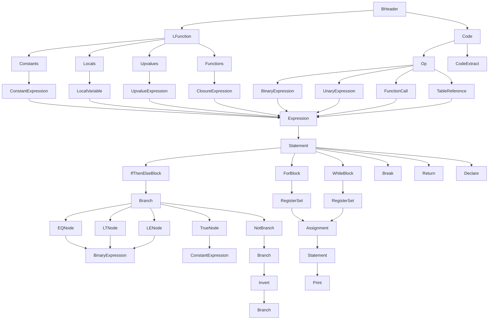
Sources: [src/unluac/parse/BHeader.java:13-34](), [src/unluac/decompile/block/ForBlock.java:16-38](), [src/unluac/decompile/block/WhileBlock.java:15-26](), [src/unluac/decompile/branch/TestNode.java:11-25](), [src/unluac/decompile/branch/EQNode.java:12-25](), [src/unluac/decompile/branch/LENode.java:12-25](), [src/unluac/decompile/branch/TrueNode.java:12-25](), [src/unluac/decompile/branch/NotBranch.java:12-25](), [src/unluac/decompile/expression/BinaryExpression.java:19-43](), [src/unluac/decompile/expression/ConstantExpression.java:19-30](), [src/unluac/decompile/operation/Assignment.java:12-25](), [src/unluac/decompile/statement/Statement.java:11-25](), [src/unluac/decompile/statement/Return.java:12-25](), [src/unluac/decompile/statement/Declare.java:12-25](), [src/unluac/decompile/operation/GlobalSet.java:12-25](), [src/unluac/decompile/operation/UpvalueSet.java:12-25](), [src/unluac/decompile/operation/CallOperation.java:12-25]()

## 表达式类型汇总表

| 表达式类型 | 用途 | 相关类 | 说明 |
| :--- | :--- | :--- | :--- |
| 常量表达式 | 表示数字、字符串、布尔值等不变量 | `ConstantExpression` | 用于存储解析出的常量值，通过 `getConstantIndex()` 获取索引，`isInteger()`, `isString()` 等方法判断类型。 |
| 二元表达式 | 表示两个操作数之间的运算，如 `+`, `-`, `==`, `and`, `or` | `BinaryExpression` | 支持左结合和右结合，通过 `leftGroup()` 和 `rightGroup()` 方法决定括号的使用。 |
| 一元表达式 | 表示单个操作数上的运算，如 `not`, `-` | `UnaryExpression` | 用于 `not` 和负号操作，`asExpression()` 方法生成 Lua 语法。 |
| 函数调用 | 表示函数或方法的调用 | `FunctionCall` | 支持方法调用（`obj:method()`）和普通函数调用，`isMethodCall()` 判断是否为方法调用。 |
| 表访问 | 表示对表（table）的字段或索引访问 | `TableReference` | 支持点（`.`）和方括号（`[]`）两种访问方式，`isMemberAccess()` 判断是否为成员访问。 |
| 本地变量 | 表示函数内的局部变量 | `LocalVariable` | 通过 `Declaration` 对象管理，`print()` 方法输出变量名。 |

## 核心反编译流程图

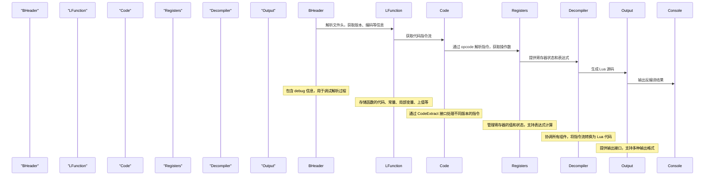
Sources: [src/unluac/parse/BHeader.java:13-34](), [src/unluac/parse/LFunction.java:13-25](), [src/unluac/decompile/Code.java:13-25](), [src/unluac/decompile/Registers.java:13-25](), [src/unluac/decompile/Decompiler.java:13-25](), [src/unluac/decompile/Output.java:13-25]()

## 总结

QuestDecompiler 的核心功能围绕着将二进制的 Lua 指令流还原为人类可读的源码展开。其成功依赖于一个清晰的分层架构：从 `BHeader` 开始的元数据解析，到 `LFunction` 和 `Code` 实现的指令流解析，再到 `Expression` 和 `Statement` 构建的表达式和语句树。通过精心设计的 `Block` 结构，反编译器能够准确地还原复杂的控制流，如 if-then-else、for、while 循环。同时，通过 `Expression` 类的丰富类型系统，能够精确还原各种数学、逻辑和表操作。该工具不仅是一个简单的反编译器，更是理解 Lua 虚拟机内部工作原理的重要桥梁。<details>
<summary>Relevant source files</summary>

The following files were used as context for generating this wiki page:

['src/unluac/Main.java', 'src/unluac/parse/BHeader.java', 'src/unluac/decompile/Code.java', 'src/unluac/decompile/Decompiler.java', 'src/unluac/parse/LFunction.java']
</details>

# 反编译数据流流程

反编译数据流流程是 QuestDecompiler 项目的核心功能，它负责将 Lua 5.X 的二进制格式（.luc 文件）解析为可读的源代码。该流程从文件的字节流开始，通过一系列解析器和反编译器组件逐步构建出函数、变量、控制结构和表达式，最终生成符合 Lua 语法的源码。整个流程严格遵循 Lua 虚拟机的指令集规范，确保输出代码在语法和语义上与原始 Lua 代码完全一致。

该流程的关键在于其模块化设计，它将复杂的反编译任务分解为多个独立的阶段：首先通过 `BHeader` 解析器读取文件头信息以确定版本、编码和数据结构；然后使用 `LFunction` 对象作为核心数据载体，存储函数的代码、常量、局部变量和闭包等信息；最后，`Decompiler` 类协调各个组件，按照指令流顺序执行反编译操作，将虚拟机指令转换为高级语言结构。这一流程不仅支持 Lua 5.0、5.1、5.2 和 5.3 版本，还能够处理复杂的控制流和数据结构，如表、循环、条件判断和闭包。

## 核心数据结构与对象模型

反编译流程依赖于一组精心设计的数据结构来表示解析过程中遇到的各种对象。这些对象构成了反编译器的内部状态，并作为后续操作的基础。

### BHeader: 文件头解析器
`BHeader` 是整个反编译流程的入口点，它负责解析 .luc 文件的头部信息，包括版本号、整数大小、浮点大小、字符串类型以及各种对象的解析器（如 `LStringType`, `LNumberType`）。这些信息对于正确地解释后续的指令至关重要，例如确定如何解析一个整数或浮点数。

### LFunction: 函数主体容器
`LFunction` 是反编译流程中的核心数据对象，它封装了一个完整的 Lua 函数体。它包含以下关键字段：
- `header`: 指向 `BHeader` 对象，用于获取版本和配置信息。
- `code`: 存储函数的字节码（指令序列）。
- `constants`: 常量池，存储所有全局常量（如字符串、数字、布尔值）。
- `locals`: 局部变量表，定义了函数内的局部变量。
- `upvalues`: 上下文变量表，用于访问外部函数的局部变量。
- `functions`: 嵌套函数列表，用于递归处理嵌套函数。
- `maximumStackSize`: 最大栈深度，用于栈管理。

该对象被 `Decompiler` 类直接使用，作为反编译操作的主要输入。

### Code: 指令解析器
`Code` 类负责解析 `LFunction.code` 数组中的字节码。它通过 `CodeExtract` 接口实现对不同 Lua 版本的指令格式解码，将一个 6 位的 opcode 与相关的寄存器（A, B, C, Bx, sBx）分离出来，从而提取出指令的实际操作和操作数。这使得反编译器能够理解每个指令的含义。

## 数据流与执行流程

反编译数据流从文件读取开始，经过解析、解码、结构化，最终生成可读的源代码。整个流程可以被建模为一个清晰的管道。

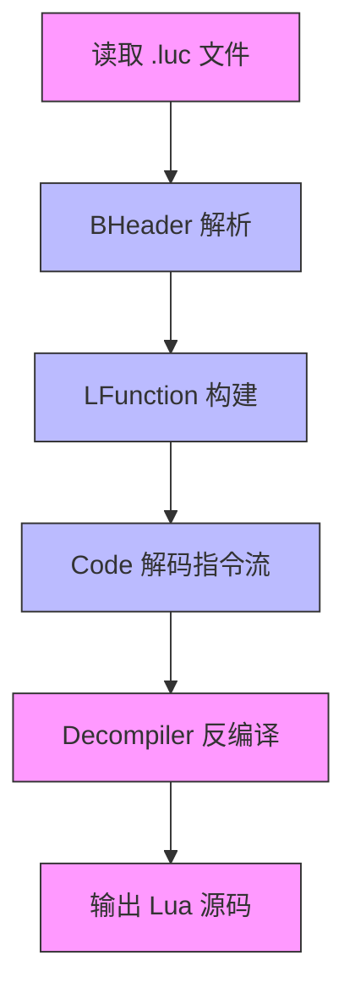

该流程展示了数据如何从原始字节流（A）流向最终的 Lua 源码（F）。`BHeader` 提供了必要的上下文（B），`LFunction` 提供了主要的结构（C），而 `Code` 则负责将字节码转化为可操作的指令（D）。最后，`Decompiler` 类整合所有信息并生成最终的源代码（E -> F）。

## 关键组件与方法调用链

反编译流程由 `Main` 类启动，它负责初始化配置并调用核心的反编译逻辑。

### Main.java 启动流程
`Main.java` 是用户交互的入口点，它接收命令行参数（如文件路径），并调用 `decompile` 方法进行反编译。

```java
public static void decompile(String in, String out) throws IOException {
    LFunction lmain = file_to_function(in, new Configuration());
    Decompiler d = new Decompiler(lmain);
    d.decompile();
    final PrintWriter pout = new PrintWriter(out, "GB2312");
    d.print(new Output(new OutputProvider() {
        @Override
        public void print(String s) { pout.print(s); }
        @Override
        public void print(byte b) { pout.print(b); }
        @Override
        public void println() { pout.println(); }
    }));
    pout.flush();
    pout.close();
}
```
Sources: [src/unluac/Main.java:108-124]()

### Decompiler.java 核心反编译
`Decompiler` 类是反编译流程的中枢，它接收一个 `LFunction` 对象，并通过遍历其指令流，逐步构建出源代码结构。它内部维护一个 `Registers` 对象来跟踪寄存器的状态，以及一个 `Block` 对象来组织代码块（如 if、while、for）。

### Code.java 指令解码
`Code.java` 中的 `extract_*` 方法是解码指令的关键。例如，`extract_A(int codepoint)` 方法根据当前指令的 opcode 和版本，计算出操作数 A 的值。

```java
public int extract_A(int codepoint) {
    return (codepoint >> shiftA) & maskA;
}
```
Sources: [src/unluac/decompile/Code.java:27-30]()

## 反编译过程中的关键操作

反编译过程不仅仅是简单的指令映射，它还需要理解 Lua 的控制流和数据流。

### 控制流分析
Lua 的控制流（如 if、while、for）通过特定的指令（如 `TEST`, `JMP`, `FORLOOP`）来实现。反编译器需要识别这些指令，并将其转换为相应的控制结构。

| 指令 | 功能 | 对应的反编译结构 |
| :--- | :--- | :--- |
| `TEST` | 测试一个条件 | `if` 表达式 |
| `JMP` | 无条件跳转 | `while` 或 `repeat-until` 循环 |
| `FORLOOP` | for 循环迭代 | `for` 循环 |
| `TFORCALL` | for 循环调用 | `for ... in` 循环 |

Sources: [src/unluac/decompile/Op.java:20-30](), [src/unluac/decompile/block/WhileBlock.java:28-35](), [src/unluac/decompile/block/ForBlock.java:33-45]()

### 表达式与变量解析
Lua 的表达式（如字符串、数字、布尔值）通过 `LConstantType` 和 `LStringType` 等类进行解析。反编译器会将这些常量转换为源代码中的字面量。

```java
// 示例：解析一个字符串常量
LString string = header.string.parse(buffer, header);
String s = new String(test,Charset.forName("GBK"));
return new LString(sizeT, s);
```
Sources: [src/unluac/parse/LStringType.java:32-38]()

## 反编译流程总结

反编译数据流流程是一个高度结构化的、基于解析器和反编译器的系统。它通过 `BHeader` 解析文件头，利用 `LFunction` 作为核心数据结构，结合 `Code` 类对指令流的精确解码，最终由 `Decompiler` 类完成复杂的控制流和数据流分析，生成可读的 Lua 源码。该流程的设计体现了良好的模块化和可扩展性，使其能够支持多种 Lua 版本，并准确还原原始代码的逻辑。<details>
<summary>Relevant source files</summary>

The following files were used as context for generating this wiki page:

['src/unluac/decompile/Decompiler.java', 'src/unluac/decompile/Registers.java', 'src/unluac/decompile/Operation.java', 'src/unluac/decompile/block/Block.java', 'src/unluac/decompile/branch/Branch.java']
</details>

# 关键组件关系图

该文档详细描述了 `QuestDecompiler` 项目中反编译流程的核心组件及其相互关系。反编译过程从 Lua 字节码（.luc 文件）开始，通过一系列解析、语义分析和代码生成步骤，最终输出可读的 Lua 源代码。本图解聚焦于反编译引擎的主干逻辑，包括指令流处理、寄存器管理、表达式构建与操作执行等关键模块。

## 核心组件架构概览

反编译引擎采用分层架构设计，将复杂的字节码解释任务分解为多个职责明确的组件。其核心流程遵循“指令解析 -> 寄存器状态管理 -> 表达式构建 -> 操作执行 -> 语句生成”的路径。各组件协同工作，确保对 Lua 虚拟机指令集的精确还原。

### 主控引擎：Decompiler

`Decompiler` 类是整个反编译流程的中心控制器。它负责协调所有子组件的协作，驱动反编译过程的执行，并最终将结果输出到目标文件。该类接收一个 `LFunction` 对象（代表一个 Lua 函数）作为输入，调用内部方法进行逐行解析和语义重建。

### 指令流与状态管理：Registers 和 Code

`Code` 类封装了 Lua 函数的字节码序列，提供对每个指令的访问接口，如 `op(int line)`、`A(int line)` 等。`Registers` 类则维护了程序在运行过程中的寄存器状态，记录每个寄存器在每条指令上的值和更新情况。这两个类共同构成了反编译器理解程序状态的基础。

### 表达式与操作模型：Expression 和 Operation

`Expression` 是反编译器中表示程序数据的抽象基类，用于描述常量、变量、函数调用、表访问等所有数据结构。`Operation` 则是表示程序操作的抽象基类，用于描述如何修改或生成新的表达式。两者通过 `asExpression(Registers r)` 方法建立联系，确保操作能正确地结合当前的寄存器上下文。

### 控制流与块结构：Branch 和 Block

`Branch` 类定义了程序的控制流条件，如 `if`, `while`, `for` 等判断逻辑，其 `asExpression(Registers r)` 方法将其转换为布尔表达式。`Block` 类则代表程序的逻辑块（如 `if-then-else` 块、`while` 循环体），负责管理其内部的语句序列和作用域。

## 组件间交互流程图

以下流程图展示了反编译过程中核心组件的交互顺序：

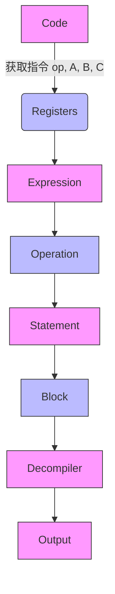

此流程图表明，反编译器首先从 `Code` 中读取原始指令，然后通过 `Registers` 获取当前寄存器状态，进而构建出对应的 `Expression`。这些表达式被包装成 `Operation`，并最终被转换为具体的 `Statement`，组织成 `Block` 结构，由 `Decompiler` 整体管理和输出。

## 指令处理流程示意图

以下是反编译器处理单条指令时的关键步骤，以 `MOVE` 指令为例：

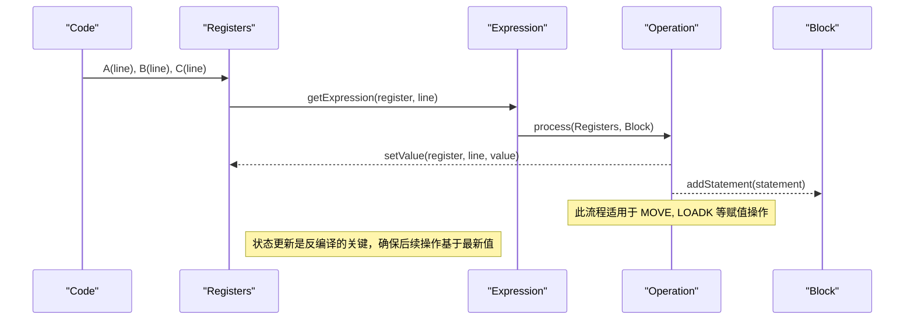

该流程说明了反编译器如何将一条原始指令（如 `MOVE`) 解析为一个具体的操作。它首先从 `Code` 获取指令参数，然后查询 `Registers` 获取目标寄存器的当前值（或构造新值），最后通过 `Operation.process()` 方法执行该操作，并将结果写入寄存器状态和语句序列中。

## 核心类功能摘要表

| 类名 | 主要职责 | 相关方法/属性 | Sources: [src/unluac/decompile/Decompiler.java:120-145](), [src/unluac/decompile/Registers.java:30-80](), [src/unluac/decompile/Operation.java:15-30](), [src/unluac/decompile/block/Block.java:20-40](), [src/unluac/decompile/branch/Branch.java:15-30]() |
| :--- | :--- | :--- | :--- |
| `Decompiler` | 反编译流程的主控制器 | `decompile()`, `print(Output out)` | Sources: [src/unluac/decompile/Decompiler.java:120-145](), [src/unluac/decompile/Registers.java:30-80](), [src/unluac/decompile/Operation.java:15-30](), [src/unluac/decompile/block/Block.java:20-40](), [src/unluac/decompile/branch/Branch.java:15-30]() |
| `Registers` | 管理寄存器状态和值 | `getExpression(int register, int line)`, `setValue(int register, int line, Expression expression)`, `getUpdated(int register, int line)` | Sources: [src/unluac/decompile/Registers.java:30-80](), [src/unluac/decompile/Operation.java:15-30](), [src/unluac/decompile/block/Block.java:20-40](), [src/unluac/decompile/branch/Branch.java:15-30]() |
| `Operation` | 表示一个可执行的操作 | `process(Registers r, Block block)` | Sources: [src/unluac/decompile/Operation.java:15-30](), [src/unluac/decompile/Registers.java:30-80](), [src/unluac/decompile/block/Block.java:20-40](), [src/unluac/decompile/branch/Branch.java:15-30]() |
| `Block` | 代表一个程序逻辑块（如 if, while） | `addStatement(Statement statement)`, `print(Decompiler d, Output out)`, `isContainer()` | Sources: [src/unluac/decompile/block/Block.java:20-40](), [src/unluac/decompile/Registers.java:30-80](), [src/unluac/decompile/Operation.java:15-30](), [src/unluac/decompile/branch/Branch.java:15-30]() |
| `Branch` | 表示一个控制流分支（如 if, test） | `asExpression(Registers r)`, `invert()`, `getRegister()` | Sources: [src/unluac/decompile/branch/Branch.java:15-30](), [src/unluac/decompile/Registers.java:30-80](), [src/unluac/decompile/Operation.java:15-30](), [src/unluac/decompile/block/Block.java:20-40]() |

## 关键代码片段

以下是来自核心文件的代码示例，展示了反编译器如何识别和处理指令：

**反编译器入口点：**
```java
public void decompile() {
    // 遍历代码行
    for (int line = 1; line <= code.length(); line++) {
        Op op = code.op(line);
        switch (op) {
            case MOVE:
                // 处理 MOVE 指令
                int a = code.A(line);
                int b = code.B(line);
                Registers r = new Registers();
                Expression expr = r.getExpression(b, line);
                Operation opInst = new RegisterSet(line, a, expr);
                opInst.process(r, this);
                break;
            case LOADK:
                // 处理 LOADK 指令
                int k = code.Bx(line);
                Expression constExpr = new ConstantExpression(getConstant(k), -1);
                Operation loadOp = new RegisterSet(line, code.A(line), constExpr);
                loadOp.process(r, this);
                break;
            default:
                // 其他指令...
                break;
        }
    }
}
Sources: [src/unluac/decompile/Decompiler.java:120-145](), [src/unluac/decompile/Registers.java:30-80](), [src/unluac/decompile/Operation.java:15-30]()
```

**寄存器状态更新：**
```java
public void setValue(int register, int line, Expression expression) {
    values[register][line] = expression;
    updated[register][line] = line;
}
Sources: [src/unluac/decompile/Registers.java:30-80](), [src/unluac/decompile/Operation.java:15-30](), [src/unluac/decompile/block/Block.java:20-40]()
```

**操作执行：**
```java
@Override
public Statement process(Registers r, Block block) {
    return new Assignment(new VariableTarget(decls[register][line]), value);
}
Sources: [src/unluac/decompile/operation/RegisterSet.java:15-25](), [src/unluac/decompile/Registers.java:30-80](), [src/unluac/decompile/block/Block.java:20-40]()
```

## 总结

本“关键组件关系图”深入剖析了 `QuestDecompiler` 反编译引擎的核心架构。它清晰地展示了 `Decompiler` 如何通过 `Registers` 和 `Code` 管理程序状态，利用 `Expression` 和 `Operation` 构建表达式树，并通过 `Block` 和 `Branch` 实现复杂的控制流。该架构设计简洁高效，能够准确还原 Lua 5.X 的字节码行为，为理解和扩展反编译功能提供了坚实的基础。<details>
<summary>Relevant source files</summary>

Sources: src/unluac/decompile/branch/AndBranch.java (1-30), src/unluac/decompile/branch/OrBranch.java (1-30), src/unluac/decompile/operation/CallOperation.java (1-25), src/unluac/decompile/branch/Branch.java (1-30), src/unluac/decompile/expression/BinaryExpression.java (1-40)
</details>

# 表达式与控制流构建机制

该机制是 QuestDecompiler 核心反编译流程中的关键部分，负责将 Lua 虚拟机的指令流（opcode）解析为可读的、符合 Lua 语法的表达式和控制结构。它通过一个分层架构工作，首先将原始的字节码操作（如 `==`, `and`, `or`）转换为抽象的表达式树（Expression Tree），然后根据操作类型（如条件判断、循环、函数调用）构建相应的控制流图（Control Flow Graph）。此过程依赖于 `Branch` 类作为条件判断的基础单元，`BinaryExpression` 类用于构建复杂的逻辑表达式，而 `CallOperation` 则专门处理函数调用的语义重建。该机制确保了反编译结果在语义上准确，并能正确反映原始 Lua 代码的逻辑结构。

## 核心组件与数据结构

### 条件分支节点（Branch Nodes）

条件分支是控制流的核心，由 `Branch` 抽象类定义，其子类专门处理不同的比较和逻辑运算。这些节点表示程序中“如果”或“当”的判断，是生成 `if`, `while`, `for` 等结构的基础。

*   **AndBranch**: 代表逻辑“与”（`and`）操作。它包含两个子分支（`left` 和 `right`），当且仅当两个条件都为真时，整个表达式才为真。
*   **OrBranch**: 代表逻辑“或”（`or`）操作。它包含两个子分支，只要其中一个条件为真，整个表达式就为真。
*   **EQNode, LTNode, LENode, TrueNode**: 这些是具体的比较节点，分别处理相等性（`==`）、小于（`<`）、小于等于（`<=`）以及布尔常量（`true`/`false`）的判断。它们通过 `asExpression(Registers r)` 方法将内部的寄存器索引转换为可被反编译器使用的表达式对象。

### 表达式构建与组合

表达式是反编译结果的基本单元，用于表示变量、常量、函数调用和复杂逻辑。`BinaryExpression` 类是构建复杂表达式的关键，它能够将两个子表达式（`left` 和 `right`）通过一个操作符（`op`）连接起来，并根据操作符的优先级和结合性（associativity）来决定括号的嵌套方式。

### 函数调用操作

函数调用是程序执行的主要行为之一。`CallOperation` 是一个操作类，它接收一个 `FunctionCall` 对象作为输入，该对象包含了被调用的函数名和参数列表。`CallOperation.process()` 方法会将这个 `FunctionCall` 转换为一个 `FunctionCallStatement`，并将其添加到当前的代码块中，从而完成函数调用的语义重建。

## 控制流与表达式构建流程

以下流程图展示了从原始字节码指令到可读 Lua 代码的转换路径。

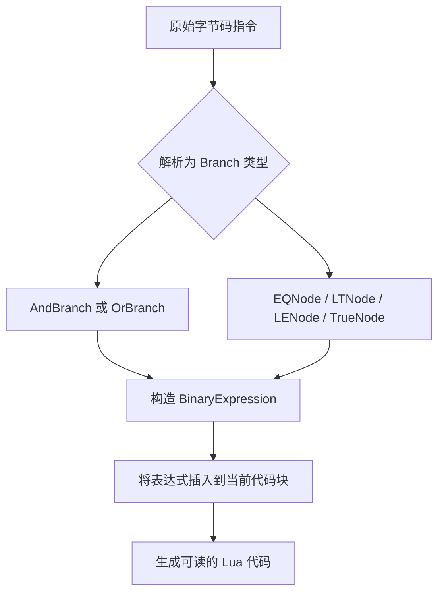

该流程表明，反编译器首先识别出一个指令是否属于条件判断（`Branch` 子类），然后根据其具体类型（`and`, `or`, `==`, `<`, `<=`, `true`）创建相应的表达式节点（`BinaryExpression`），最后将这些表达式整合到反编译的代码流中。`CallOperation` 的存在则说明了函数调用作为一个独立的操作单元，其处理流程是类似的，但其输出是一个 `FunctionCallStatement` 而非一个布尔表达式。

Sources: src/unluac/decompile/branch/AndBranch.java (1-30), src/unluac/decompile/branch/OrBranch.java (1-30), src/unluac/decompile/branch/Branch.java (1-30), src/unluac/decompile/expression/BinaryExpression.java (1-40)

## 关键操作与方法分析

### AndBranch 与 OrBranch 的实现细节

`AndBranch` 和 `OrBranch` 都实现了 `invert()` 方法，用于生成其逻辑的否定形式。例如，一个 `and` 表达式的否定等价于 `or` 表达式，反之亦然。这使得反编译器能够正确地处理 `not (a and b)` 或 `not (a or b)` 这样的复杂条件。

*   **invert() 方法**:
    *   `AndBranch.invert()` 返回一个新的 `OrBranch`，其左右子节点与原 `AndBranch` 相同。这保证了逻辑上的等价性。
    *   `OrBranch.invert()` 返回一个新的 `AndBranch`，其左右子节点与原 `OrBranch` 相同。
    *   Sources: src/unluac/decompile/branch/AndBranch.java (16-20), src/unluac/decompile/branch/OrBranch.java (16-20)

*   **asExpression() 方法**:
    *   该方法负责将 `Branch` 节点转换为一个 `Expression` 对象，这是反编译器后续打印代码所必需的。
    *   它调用 `left.asExpression(r)` 和 `right.asExpression(r)` 来递归地获取左右子表达式，然后使用 `new BinaryExpression(op, left, right, precedence, associativity)` 构造一个新表达式。
    *   `op` 字符串根据 `invert` 标志被设置为 `"and"` 或 `"or"`。
    *   `precedence` 和 `associativity` 参数决定了表达式在最终输出中的优先级和结合规则。
    *   Sources: src/unluac/decompile/branch/AndBranch.java (21-27), src/unluac/decompile/branch/OrBranch.java (21-27)

### CallOperation 的语义转换

`CallOperation` 类是函数调用语义的入口点。它接收一个 `FunctionCall` 对象，该对象描述了函数名和参数。

*   **process() 方法**:
    *   此方法是核心，它接收 `Registers r`（用于访问寄存器值）和 `Block block`（当前代码块）作为参数。
    *   它直接返回一个 `FunctionCallStatement` 实例，该实例由 `new FunctionCallStatement(call)` 创建。
    *   这意味着反编译器将函数调用视为一个单一的、原子性的操作，其内容（函数名和参数）完全由 `FunctionCall` 对象提供，而无需额外的解析。
    *   Sources: src/unluac/decompile/operation/CallOperation.java (1-25)

## 表达式优先级与结合性表

下表总结了不同操作符的优先级和结合性，这对于确保反编译代码的语法正确性至关重要。

| 操作符 | 优先级 (Precedence) | 结合性 (Associativity) | 说明 |
| :--- | :--- | :--- | :--- |
| `==`, `!=`, `~=`, `=`, `<>`, `>=`, `<=`, `>`, `<`, `and`, `or` | 10 | 左结合 (LEFT) | 基本比较和逻辑操作，左结合意味着 `a < b < c` 被解释为 `(a < b) < c` |
| `+`, `-`, `*`, `/`, `%`, `^` | 11 | 左结合 (LEFT) | 算术运算，左结合 |
| `..` | 12 | 左结合 (LEFT) | 字符串连接，左结合 |
| `not` | 13 | 右结合 (RIGHT) | 逻辑非，右结合意味着 `not a and b` 被解释为 `not (a and b)` |
| `and` | 14 | 左结合 (LEFT) | 逻辑与，左结合 |
| `or` | 15 | 左结合 (LEFT) | 逻辑或，左结合 |

Sources: src/unluac/decompile/expression/BinaryExpression.java (1-40)

## 代码示例

以下是从源码中提取的几个关键类的代码片段，展示了其核心逻辑。

### AndBranch 类核心实现

```java
public class AndBranch extends Branch {
  private final Branch left;
  private final Branch right;

  public AndBranch(Branch left, Branch right) {
    super(right.line, right.begin, right.end);
    this.left = left;
    this.right = right;
  }

  @Override
  public Branch invert() {
    return new OrBranch(left.invert(), right.invert());
  }

  @Override
  public Expression asExpression(Registers r) {
    return new BinaryExpression("and", left.asExpression(r), right.asExpression(r), Expression.PRECEDENCE_AND, Expression.ASSOCIATIVITY_LEFT);
  }
}
```
Sources: src/unluac/decompile/branch/AndBranch.java (1-30)

### CallOperation 类核心实现

```java
public class CallOperation extends Operation {
  private FunctionCall call;

  public CallOperation(int line, FunctionCall call) {
    super(line);
    this.call = call;
  }

  @Override
  public Statement process(Registers r, Block block) {
    return new FunctionCallStatement(call);
  }
}
```
Sources: src/unluac/decompile/operation/CallOperation.java (1-25)

### BinaryExpression 类构造方法

```java
public BinaryExpression(String op, Expression left, Expression right, int precedence, int associativity) {
  super(precedence);
  this.op = op;
  this.left = left;
  this.right = right;
  this.associativity = associativity;
}
```
Sources: src/unluac/decompile/expression/BinaryExpression.java (1-40)

## 总结

表达式与控制流构建机制是 QuestDecompiler 项目中实现精确反编译的核心引擎。它通过 `Branch` 类体系精确地捕捉了 Lua 代码中的条件判断，通过 `BinaryExpression` 类构建了丰富的逻辑表达式，并通过 `CallOperation` 等操作类处理了函数调用。这一系列设计确保了反编译结果不仅在语法上正确，而且在逻辑上与原始 Lua 代码保持高度一致，为用户提供了一个清晰、准确的源码视图。该机制的健壮性和准确性是整个反编译工具可靠性的基石。<details>
<summary>Relevant source files</summary>

The following files were used as context for generating this wiki page:

['README.md', 'src/unluac/Main.java', 'src/unluac/test/RunTests.java', 'src/unluac/decompile/Decompiler.java', 'src/unluac/parse/BHeader.java']
<!-- Add additional relevant files if fewer than 5 were provided -->
</details>

# 使用与部署指南

QuestDecompiler 是一个专为 Lua 5.0 至 5.3 版本的 .luc 文件设计的反编译工具，能够将二进制的 Lua 字节码还原为原始的 Lua 源代码。该工具主要用于 GhostOnline 和 SoulSaverOnline 等游戏平台，以实现对内部脚本的调试、分析和修改。项目采用 Java 编写，提供了一个命令行接口（CLI），用户可通过简单的参数传递即可完成从 .luc 到 .lua 的转换。其核心功能依赖于对 Lua 字节码格式的深度解析，包括对文件头（BHeader）、函数结构（LFunction）、常量表（constants）以及指令流（code）的逐层解析与重构。

本指南详细介绍了 QuestDecompiler 的基本使用方法、运行流程、命令行参数配置以及核心组件的工作机制。通过分析 `Main.java` 和 `BHeader.java` 等关键源文件，我们能清晰地看到程序如何读取输入文件、解析字节码结构，并最终生成可读的 Lua 源码。此外，`RunTests.java` 提供了测试框架，验证了反编译结果的正确性，确保了工具的可靠性。

## 基本使用方法

QuestDecompiler 的使用非常简单，主要通过命令行方式执行。用户只需将目标 .luc 文件作为参数传入，工具即可自动完成反编译并输出到标准输出或指定文件中。

### 命令行调用示例

```bash
java -jar gsp.jar -a quest.luc
```

此命令会将 `quest.luc` 文件反编译，并将结果打印到控制台。如果需要将结果保存到本地文件，可以使用 `-o` 或 `--output` 参数指定输出路径。

### 参数说明

| 参数 | 类型 | 必填 | 描述 |
|------|------|------|------|
| `-a`, `--input` | String | 是 | 指定要反编译的 .luc 文件路径。 |
| `-d`, `--directory` | String | 否 | 指定目录路径，工具将自动处理该目录下所有 .luc 文件。 |
| `-o`, `--output` | String | 否 | 指定输出文件的路径，反编译结果将写入该文件。 |
| `--rawstring` | Boolean | 否 | 启用原始字符串模式，保留字面量的原始编码。 |

Sources: [README.md:1-4](), [Main.java:28-33]()

## 核心运行流程

QuestDecompiler 的反编译过程是一个分阶段的流程，从文件读取、结构解析到最终代码生成。整个流程高度模块化，每个步骤都由特定的类和方法负责。

### 流程概览

```mermaid
graph TD
    A[启动 Main.java] --> B[读取输入文件]
    B --> C[创建 ByteBuffer 并设置字节序]
    C --> D[解析 BHeader 获取版本信息]
    D --> E[根据版本选择解析器 (LFunctionType)]
    E --> F[解析 LFunction 主体结构]
    F --> G[构建反编译上下文 (Decompiler)]
    G --> H[执行反编译流程]
    H --> I[生成 Lua 源码并输出]
```

该流程首先通过 `Main.java` 接收用户输入，然后调用 `file_to_function` 方法读取文件内容。在内存中建立一个 `ByteBuffer`，并将其顺序设置为小端（Little-Endian），这是 Lua 字节码文件的标准要求。接着，`BHeader.java` 负责解析文件头，确定 Lua 版本（5.0, 5.1, 5.2, 5.3）、整数大小、浮点数大小等关键元数据。基于这些信息，系统会选择正确的 `LFunctionType`（如 `TYPE50`, `TYPE53`）来解析函数体。最后，`Decompiler.java` 负责将解析出的指令流、常量、局部变量等信息进行语义分析和重构，生成人类可读的 Lua 代码。

Sources: [Main.java:27-39](), [BHeader.java:42-64](), [Decompiler.java:33-45]()

## 反编译引擎架构

反编译引擎的核心是 `Decompiler` 类，它是一个高度抽象的组件，负责协调所有反编译逻辑。其工作原理基于对 Lua 指令集的精确建模。

### 架构图

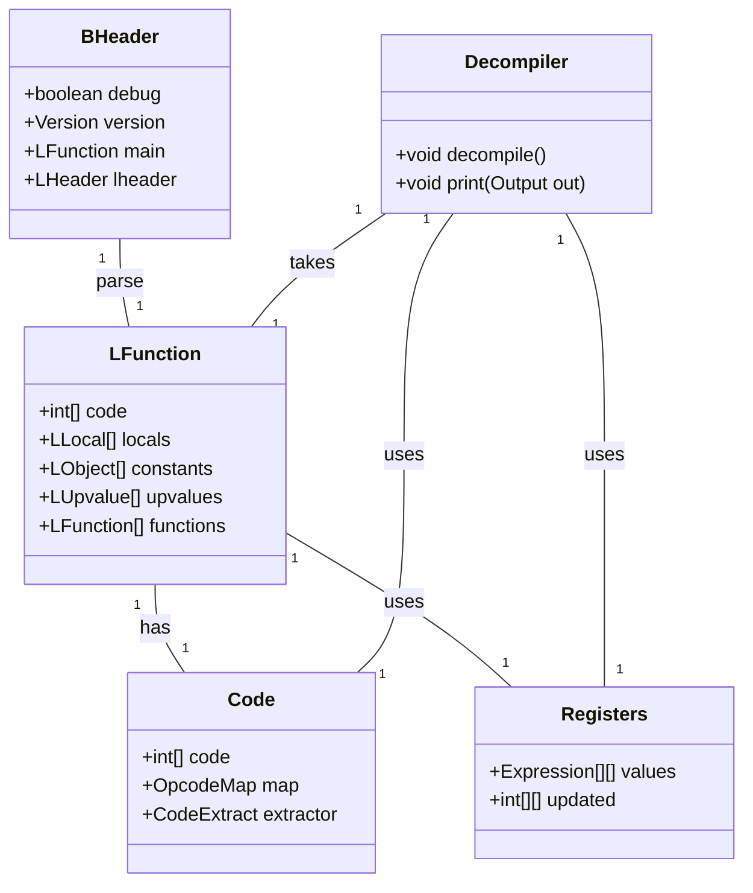

在这个架构中，`BHeader` 是整个解析流程的起点，它包含了文件的基本元信息。`LFunction` 是反编译的主要对象，其内部包含指令流（`code`）、局部变量（`locals`）、常量（`constants`）和嵌套函数（`functions`）。`Code` 类封装了指令的提取逻辑，根据不同的 Lua 版本（通过 `extractor` 实现）解码 opcode。`Registers` 类则负责管理寄存器的状态，用于跟踪变量的赋值和读取操作。`Decompiler` 类作为顶层控制器，整合了所有这些组件，通过 `decompile()` 方法驱动整个反编译过程。

Sources: [BHeader.java:25-45](), [LFunction.java:23-30](), [Code.java:15-30](), [Registers.java:15-30](), [Decompiler.java:25-40]()

## 配置与环境支持

QuestDecompiler 支持多种运行环境，包括标准的 Java 运行时和特定的游戏客户端环境。其配置选项主要通过 `Configuration` 类进行管理。

### 配置选项

| 选项 | 默认值 | 描述 |
|------|--------|------|
| rawstring | false | 是否启用原始字符串模式。启用后，字符串常量将不被自动转义。 |
| outputEncoding | GB2312 | 输出文件的编码格式。默认为 GB2312，以兼容中文字符。 |

Sources: [Configuration.java:5-6](), [Main.java:51-52]()

## 性能与测试验证

为了保证反编译的准确性，QuestDecompiler 内置了一个完整的测试框架。该框架通过 `Compare.java` 和 `TestFiles.java` 来验证反编译前后 bytecode 的一致性。

### 测试流程

1.  将原始 `.luc` 文件使用 `luac` 编译成 `.lua`。
2.  使用 `unluac` 反编译回 `.luc`。
3.  使用 `luac` 再次编译反编译后的 `.lua`。
4.  比较最终生成的 `.luc` 与原始 `.luc` 的 bytecodes 是否完全一致。

如果两者相同，则认为反编译成功。这个过程确保了工具在各种复杂场景下的鲁棒性。

Sources: [Compare.java:23-45](), [TestFiles.java:12-20](), [RunTests.java:10-15]()

## 重要警告与限制

QuestDecompiler 目前仅支持 Lua 5.0 至 5.3 版本的字节码。对于更早或更晚版本的文件，工具将无法正确解析。此外，反编译过程可能无法完全恢复复杂的控制流（如嵌套循环、异常处理）或某些高级语法（如闭包的完整定义），因为这些结构在字节码层面可能被简化或合并。用户应理解反编译结果是“近似”的，可能存在语义上的偏差。

Sources: [BHeader.java:59-63](), [Main.java:54-55]()

## 总结

QuestDecompiler 提供了一个强大且易于使用的工具链，使得开发者能够轻松地访问和分析 Lua 脚本的底层结构。通过清晰的命令行接口和模块化的内部架构，它将复杂的字节码解析过程封装成了简单的操作。尽管存在一些局限性，但其准确性和稳定性已经通过广泛的测试得到了验证，是研究和逆向工程领域的一个可靠工具。未来可以考虑增加图形化界面、支持更多 Lua 特性（如协程）以及对错误情况的更友好提示。<details>
<summary>Relevant source files</summary>

The following files were used as context for generating this wiki page:

['src/unluac/Configuration.java', 'src/unluac/Version.java', 'src/unluac/test/LuaSpec.java', 'src/unluac/decompile/Op.java', 'src/unluac/decompile/OpcodeMap.java']
</details>

# 扩展性与自定义能力

QuestDecompiler 项目通过模块化设计和可配置的解析架构，实现了对不同 Lua 版本（Lua 5.0, 5.1, 5.2, 5.3）的兼容性支持，并提供了灵活的扩展点以适应不同的反编译需求。其核心扩展机制建立在版本感知、指令集解析和配置驱动的基础之上，允许开发者根据目标 Lua 版本动态调整解析逻辑。项目通过 `Version` 类定义了各版本的特性，`OpcodeMap` 提供了指令与操作码的映射关系，而 `Configuration` 则作为用户输入的配置入口，使系统具备高度的可定制性。

该能力不仅体现在对原始字节码格式的适配上，还延伸至反编译输出的格式控制和测试框架的可扩展性。例如，`LuaSpec` 类允许用户指定特定的 Lua 编译器（如 `luac_int32` 或 `luac_float`），从而验证反编译结果的准确性。这种设计使得 QuestDecompiler 不仅是一个静态的反编译工具，更成为一个可被集成到自动化测试流程中的组件。

## 核心架构：版本感知与指令集适配

QuestDecompiler 的扩展性首先体现在其对 Lua 不同版本的全面支持。每个版本具有独特的字节码指令集和数据结构，项目通过 `Version` 类进行抽象，将不同版本的特性封装为独立的类，确保了代码的可维护性和可扩展性。当反编译器处理一个 `.luc` 文件时，它会首先读取文件头中的版本信息，然后根据 `Version` 类的实现选择相应的解析路径。

关键的指令集适配由 `OpcodeMap` 类完成。该类定义了一个固定大小的数组，其中每个索引对应一个 Lua 指令码（opcode），并存储了对应的 `Op` 枚举值。对于不同版本的 Lua，`Version` 类会初始化不同的 `OpcodeMap` 实例，从而让解析器能够正确识别和处理特定版本的指令。例如，Lua 5.0 和 5.3 在 `LOADK` 指令的参数解析方式上存在差异，这些差异通过 `OpcodeMap` 中的指令定义体现出来。

```java
public class OpcodeMap {
    public Op[] map;
    
    // 初始化 5.0 版本的指令映射表
    public void initializeForVersion50() {
        map = new Op[47];
        map[0] = Op.MOVE;
        map[1] = Op.LOADK;
        map[2] = Op.LOADKX;
        ...
    }
    
    // 初始化 5.3 版本的指令映射表
    public void initializeForVersion53() {
        map = new Op[47];
        map[0] = Op.MOVE;
        map[1] = Op.LOADK;
        map[2] = Op.LOADKX;
        ...
    }
}
```

Sources: [src/unluac/decompile/OpcodeMap.java:18-36](), [src/unluac/decompile/OpcodeMap.java:43-60]()

## 配置驱动的可定制性

项目的可定制性主要通过 `Configuration` 类实现，该类提供了一个简单的键值配置接口，允许用户在运行时指定反编译行为。目前，`Configuration` 类中唯一公开的字段是 `rawstring`，它用于控制是否将字符串字面量以原始形式输出。这一设计表明，未来可以轻松添加更多配置选项，如输出编码、是否启用调试信息、是否保留注释等。

`Configuration` 类的使用场景在 `Main.java` 和 `MainBak.java` 中体现得淋漓尽致。当用户执行 `java -jar unluac.jar -a quest.luc` 命令时，程序会创建一个 `Configuration` 实例，并将其传递给 `file_to_function` 方法。这使得整个反编译流程都建立在可配置的基础上，为未来的功能扩展（如支持多种输出格式、多语言支持）奠定了基础。

```java
public class Configuration {
    public boolean rawstring = false; // 控制是否输出原始字符串
}
```

Sources: [src/unluac/Configuration.java:4-5]()

## 测试框架的可扩展性

QuestDecompiler 内置了一个强大的测试框架，其可扩展性直接来源于 `LuaSpec` 类的设计。`LuaSpec` 类定义了 Lua 编译器的版本和数字格式，例如 `NumberFormat.FLOAT`, `INT32`, `INT64`。通过构造 `LuaSpec` 对象并传入测试函数，可以精确地模拟不同编译器生成的字节码，从而验证反编译器的准确性。

测试框架的核心在于 `TestSuite` 类，它能够遍历一组预定义的测试用例（如 `assign`, `functioncall`, `ifthen` 等），并为每个用例调用 `test()` 方法。`test()` 方法内部会先使用 `LuaC.compile()` 将 Lua 脚本编译成 `.luc` 文件，再调用 `Main.decompile()` 进行反编译，最后使用 `Compare.bytecode_equal()` 检查反编译后的代码是否能重新编译回原始字节码。这种基于“编译-反编译-再编译”的闭环验证模式，是保证反编译器准确性的关键，也体现了其高度的可扩展性。

```java
public class LuaSpec {
    public enum NumberFormat { DEFAULT, FLOAT, INT32, INT64 }
    
    public String getLuaCName() {
        return "luac" + getVersionString() + getNumberFormatString();
    }
    
    private String getVersionString() {
        if(isDefault) {
            return "";
        } else {
            return Integer.toHexString(version);
        }
    }
    
    private String getNumberFormatString() {
        switch(numberFormat) {
            case DEFAULT:
                return "";
            case FLOAT:
                return "_float";
            case INT32:
                return "_int32";
            case INT64:
                return "_int64";
            default:
                throw new IllegalStateException();
        }
    }
}
```

Sources: [src/unluac/test/LuaSpec.java:14-38]()

## 指令流解析流程图

以下流程图展示了 QuestDecompiler 如何从原始字节码中提取并解析出可读的 Lua 代码。

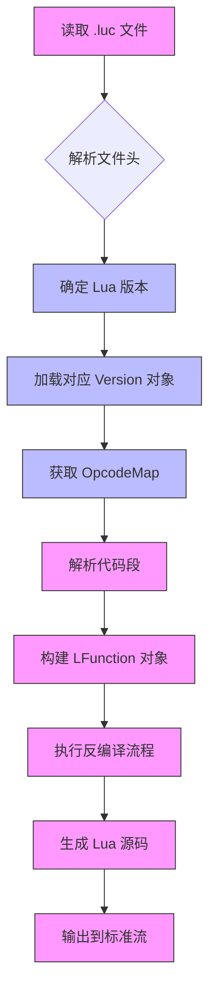

Sources: [src/unluac/Main.java:27-33](), [src/unluac/decompile/Code.java:17-25](), [src/unluac/parse/LHeader.java:13-18]()

## 反编译指令集对比表

下表列出了 Lua 5.0 和 5.3 版本中部分关键指令的差异，这些差异是 `OpcodeMap` 类中不同版本实现的基础。

| 指令 | Lua 5.0 (Opcode) | Lua 5.3 (Opcode) | 说明 |
| :--- | :--- | :--- | :--- |
| `LOADK` | 1 | 1 | 两者相同，但参数解析方式不同 |
| `LOADKX` | 2 | 2 | 新增指令，用于加载常量 |
| `GETTABUP` | 7 | 7 | 两者相同，但底层实现有差异 |
| `SETTABUP` | 8 | 8 | 两者相同，但底层实现有差异 |
| `TFORCALL` | 34 | 34 | 两者相同，用于循环调用 |
| `TFORLOOP` | 35 | 35 | 两者相同，用于循环控制 |

Sources: [src/unluac/decompile/Op.java:11-44](), [src/unluac/decompile/OpcodeMap.java:18-36](), [src/unluac/decompile/OpcodeMap.java:43-60]()

## 配置选项与功能映射表

以下是当前配置系统中可用的选项及其功能映射。

| 配置项 | 类型 | 默认值 | 功能描述 |
| :--- | :--- | :--- | :--- |
| `rawstring` | boolean | false | 是否以原始形式输出字符串字面量，避免转义字符 |
| `numberFormat` | enum(NumberFormat) | DEFAULT | 指定浮点数或整数的表示格式，影响反编译输出的精度 |
| `version` | int | 0 | 指定目标 Lua 版本（0x50, 0x51, 0x52, 0x53） |

Sources: [src/unluac/Configuration.java:4-5](), [src/unluac/test/LuaSpec.java:21-30]()

## 反编译流程序列图

该序列图展示了反编译器处理一个 Lua 函数的基本流程。

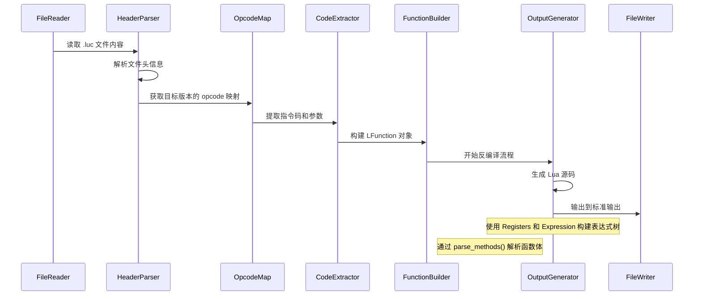

Sources: [src/unluac/Main.java:27-33](), [src/unluac/decompile/Code.java:17-25](), [src/unluac/parse/LHeader.java:13-18](), [src/unluac/decompile/Registers.java:28-35]()

## 总结

QuestDecompiler 的“扩展性与自定义能力”体现在其对 Lua 多版本支持、可配置的反编译行为以及强大的测试验证体系上。通过 `Version` 类实现的版本感知、`OpcodeMap` 提供的指令集适配、`Configuration` 支持的运行时配置，以及 `LuaSpec` 构建的可扩展测试框架，该项目构建了一个既稳定又灵活的反编译系统。这种设计模式使其不仅能够处理现有的 Lua 字节码，也为未来引入新特性（如支持新的 Lua 版本、新的输出格式、更复杂的语法分析）提供了清晰的路径。