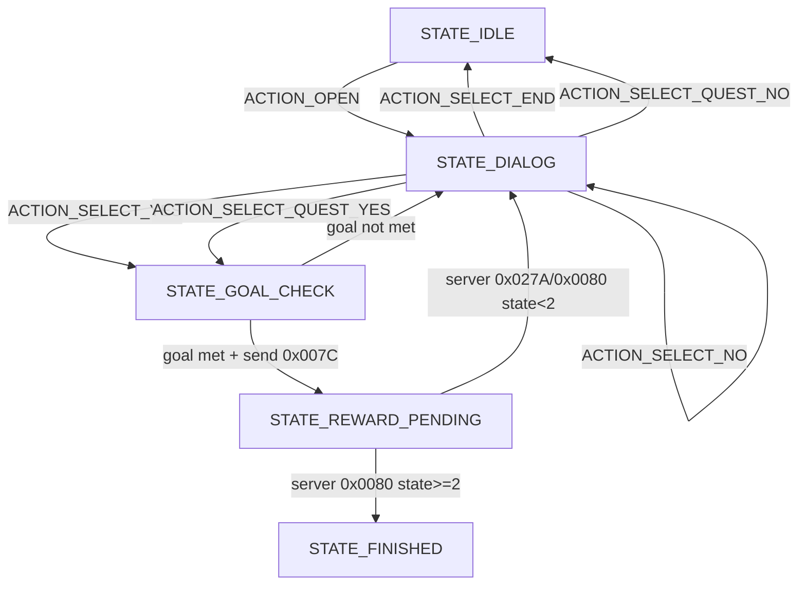

# QuestRuntimeStateModel 设计与实现

## 1. 状态对象定义

实现类：`src/unluac/semantic/QuestRuntimeState.java`

```java
class QuestRuntimeState {
  int questId;
  int state;
  int currentDialogIndex;
  boolean isComplete;
}
```

状态值定义（`QuestRuntimeStateMachine`）：

- `STATE_IDLE = 0`：未进入对话
- `STATE_DIALOG = 1`：展示 contents 行
- `STATE_CHOICE = 2`：处理 answer 选择
- `STATE_GOAL_CHECK = 3`：执行 goal 条件判定
- `STATE_REWARD_PENDING = 4`：已发提交请求，等待服务器确认
- `STATE_FINISHED = 5`：收到完成确认

---

## 2. 状态转换规则

实现类：`src/unluac/semantic/QuestRuntimeStateMachine.java`

### 2.1 事件输入

- `ACTION_OPEN`
- `ACTION_NEXT`
- `ACTION_PREV`
- `ACTION_REENTER`
- `ACTION_SELECT_YES`
- `ACTION_SELECT_NO`
- `ACTION_SELECT_END`
- `ACTION_SELECT_QUEST_YES`
- `ACTION_SELECT_QUEST_NO`

### 2.2 UI 状态码映射（逆向对应）

- `49001/49399`：内容前进
- `49002`：内容后退
- `49003`：重入对话
- `49004`：YES 分支
- `49005`：NO 分支
- `49006`：END 分支
- `49007`：IF_NO 分支
- `49015`：QUEST_YES 分支
- `49016`：QUEST_NO 分支

### 2.3 转换表

| 当前状态 | 事件 | 条件 | 下一个状态 | 输出 |
|---|---|---|---|---|
| `IDLE` | `OPEN` | - | `DIALOG` | 设置 `currentDialogIndex=首个非ANSWER行` |
| `DIALOG` | `NEXT` | - | `DIALOG` | `index+1`（边界钳制） |
| `DIALOG` | `PREV` | - | `DIALOG` | `index-1`（边界钳制） |
| `DIALOG` | `REENTER` | - | `DIALOG` | 保持当前索引 |
| `DIALOG` | `SELECT_NO` | 命中 `ANSWER_NO:` | `DIALOG` | 触发 `packet_0x007D` |
| `DIALOG` | `SELECT_END` | 命中 `ANSWER_END:` | `IDLE` | 结束对话 |
| `DIALOG` | `SELECT_QUEST_NO` | 命中 `ANSWER_QUEST_NO:` | `IDLE` | 触发 `packet_0x007B` |
| `DIALOG` | `SELECT_YES` | 命中 `ANSWER_YES:` | `GOAL_CHECK` | 进入目标检查 |
| `DIALOG` | `SELECT_QUEST_YES` | 命中 `ANSWER_QUEST_YES:` | `GOAL_CHECK` | 进入目标检查 |
| `GOAL_CHECK` | 内部判定 | goal满足 | `REWARD_PENDING` | 触发 `packet_0x007C` |
| `GOAL_CHECK` | 内部判定 | goal不满足 | `DIALOG` | 返回对话 |
| `REWARD_PENDING` | 服务器`0x0080` | `serverState>=2` | `FINISHED` | `isComplete=true` |
| `REWARD_PENDING` | 服务器`0x027A` | `serverState<2` | `DIALOG` | 刷新展示 |

---

## 3. contents 显示规则

实现方法：

- `resolveContentsLine(QuestSemanticModel model, int index)`
- `handleMove(...)`
- `contentsAt(...)`

规则：

1. 优先使用 `model.dialogLines`。
2. 索引使用 `clampDialogIndex` 进行范围钳制。
3. 当前行为 `ANSWER_` 行时，仍允许显示，并通过 `resolveVisibleAnswers` 输出可选分支。
4. 若 `dialogLines` 为空，回退到 `model.description`。

---

## 4. answer 触发规则

实现方法：

- `handleSelect(...)`
- `findNextAnswerLine(...)`
- `collectVisibleAnswers(...)`

规则：

1. 在 `currentDialogIndex` 之后顺序搜索指定前缀：
   - `ANSWER_YES:`
   - `ANSWER_NO:`
   - `ANSWER_END:`
   - `ANSWER_QUEST_YES:`
   - `ANSWER_QUEST_NO:`
2. 选中后将 `currentDialogIndex` 移动到命中的 answer 行。
3. `ANSWER_NO:` 触发返回路径事件 `dialog_no_continue:packet_0x007D`。
4. `ANSWER_QUEST_NO:` 触发放弃事件 `quest_giveup:packet_0x007B`。
5. `ANSWER_YES:` 与 `ANSWER_QUEST_YES:` 进入 `GOAL_CHECK`。

---

## 5. goal 完成判断规则

实现方法：

- `evaluateGoal(QuestSemanticModel model, QuestRuntimeGoalSnapshot snapshot)`

输入快照类：`src/unluac/semantic/QuestRuntimeGoalSnapshot.java`

规则：

1. `needLevel`：`snapshot.playerLevel >= model.goal.needLevel`。
2. `goal.items`：每项 `snapshot.getItemCount(itemId) >= itemCount`。
3. `goal.monsters`：每项 `snapshot.getKillCount(monsterId) >= killCount`。
4. 全部满足返回 `true`，否则 `false`。

---

## 6. reward 发放规则

实现方法：

- `handleSelect(...)`
- `onServerState(...)`

规则：

1. 本地 goal 满足后进入 `STATE_REWARD_PENDING`，记录 `pendingRewards`，并产生事件 `goal_met:packet_0x007C`。
2. 服务器状态应用入口 `onServerState(...)`：
   - 当 `serverState >= 2`，转 `STATE_FINISHED`，`isComplete=true`。
   - 否则回到 `STATE_DIALOG`。
3. `refresh027A=true` 时输出 UI 刷新码 `0x027A`，否则 `0x0080`。

---

## 7. AST -> RuntimeState 映射方式

实现类：`src/unluac/semantic/QuestRuntimeAstMapper.java`

映射流程：

1. 读取 `LuaChunk`。
2. 调用 `QuestSemanticExtractor.extract(chunk)` 生成 `List<QuestSemanticModel>`。
3. 对每个 `QuestSemanticModel` 创建初始状态：
   - `questId = model.questId`
   - `state = STATE_IDLE`
   - `currentDialogIndex = 首个非 ANSWER_ 行`
   - `isComplete = false`
4. 输出 `Map<Integer, QuestRuntimeState>` 供运行时调用。

映射字段关系：

| AST/语义字段 | RuntimeState 用途 |
|---|---|
| `QuestSemanticModel.questId` | `QuestRuntimeState.questId` |
| `QuestSemanticModel.dialogLines` | `currentDialogIndex` 的行解析 |
| `QuestSemanticModel.goal` | `GOAL_CHECK` 阶段判定输入 |
| `QuestSemanticModel.rewards` | `REWARD_PENDING` 阶段输出 |

---

## 8. 状态机图



---

## 9. 可运行代码入口

演示入口：`src/unluac/semantic/QuestRuntimeStateDemo.java`

运行方式：

```bash
java -cp build unluac.semantic.QuestRuntimeStateDemo D:\TitanGames\GhostOnline\zChina\Script\quest.luc
```

输出内容：

- 初始化状态
- OPEN 转换
- NEXT 转换
- QUEST_YES 转换
- 服务器状态应用转换

